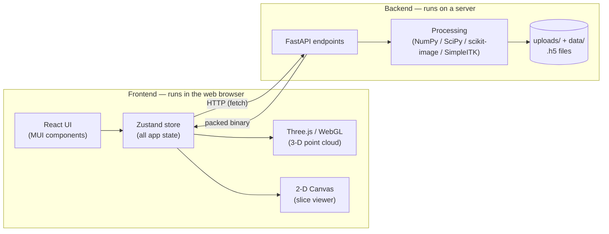
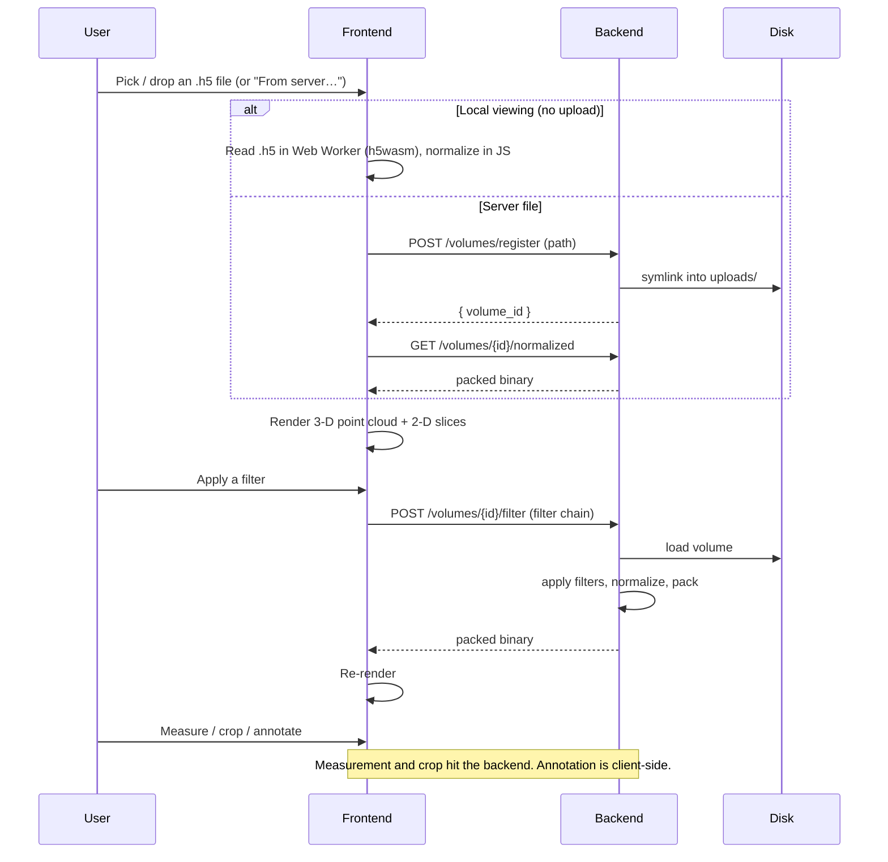

# Architecture Overview

## What Lumina is

Lumina helps researchers work with **OCT volumes** — three-dimensional scans
made of a stack of 2-D cross-section images called *slices*. A single standard
volume in Lumina is `512 × 250 × 250` voxels (a *voxel* is a 3-D pixel): 512
slices, each 250 pixels tall and 250 pixels wide.

With Lumina you can:

- **Load** volumes (by upload or directly from a server folder).
- **View** them in 3-D (as a point cloud) or in 2-D (three orthogonal slice
  panels).
- **Filter** them (blur, denoise, edge-detect, normalize).
- **Measure** distances, areas, volumes, thickness, and more.
- **Crop** out a region of interest as a new independent volume.
- **Annotate** slices with a brush.
- **Stitch** several overlapping volumes into one large merged volume.
- **Overlay** 3-D mesh models (STL files) for comparison or registration.

## The two halves

Lumina is a **monorepo** (one repository holding two projects) with a clear
division of labour:



**Backend (`backend/`)** — Python 3.11 + FastAPI, managed with the `uv` package
manager. It does *all* the heavy computation: reading `.h5` files, applying
filter chains, running stitching/registration algorithms, computing metrics and
measurements. It never renders anything; it returns numbers and render-ready
binary data.

**Frontend (`frontend/`)** — React 18 + TypeScript, built with Vite, styled with
MUI v6, rendering with Three.js, and holding state in Zustand. It is purely a
*visualization and interaction* layer: it sends requests to the backend, polls
for results, and draws what comes back.

The two communicate over plain HTTP. The frontend reads the backend's base URL
from the `VITE_API_URL` environment variable.

## Technology stack

| Layer | Technology |
|-------|-----------|
| Backend core | Python 3.11 · FastAPI · NumPy · SciPy · h5py |
| Backend imaging | scikit-image · SimpleITK |
| Backend optional | itk-elastix (B-spline stitcher) |
| Frontend core | React 18 · TypeScript · Vite |
| Frontend rendering | Three.js (WebGL) · HTML Canvas 2-D |
| Frontend state/UI | Zustand · MUI v6 |
| In-browser HDF5 read | h5wasm (in a Web Worker) |
| Infrastructure | Docker Compose · uv · Node 20 |

## Key concepts you'll see throughout

### Voxel and voxel spacing

A **voxel** is one 3-D sample. Each voxel has a physical size in micrometres
(µm), described by a triple `[dz, dy, dx]` — the spacing along the slice axis
(z), the row axis (y), and the column axis (x). The default is `[4, 4, 4]` µm
(`frontend/src/shared/constants.ts:2`), meaning each voxel represents a
4 µm × 4 µm × 4 µm cube. Because `1 mm = 1000 µm`, the constant `UM_PER_MM = 1000`
(`frontend/src/shared/constants.ts:5`) converts between the two.

### The three axes

Volumes are indexed as `(z, y, x)` = `(nSlices, height, width)`:

- **z** — which slice (depth into the stack), range `0…511`.
- **y** — row within a slice (height), range `0…249`.
- **x** — column within a slice (width), range `0…249`.

The 2-D viewer shows three orthogonal "cuts": the XY plane (fixing z), the XZ
plane (fixing y), and the YZ plane (fixing x).

### The packed binary format

This is the single most important data structure to understand, because almost
every backend endpoint that returns volume data uses it. Instead of shipping raw
32-bit floating-point numbers (which would be large and would force the browser
to do expensive work), the backend pre-processes each volume into a compact
*packed binary* and the frontend reads it with near-zero effort.

A packed response carries two HTTP headers and a binary body:

```text
Headers:
  X-Shape  = "<nSlices>,<height>,<width>"     e.g. "512,250,250"
  X-VCount = "<above-threshold voxel count>"  e.g. "8412345"

Body (one contiguous block of bytes):
  [ vIndices      : vCount × float32 ]   flat voxel indices, brightest first
  [ vIntensities  : vCount × float32 ]   matching intensities in [0, 1]
  [ normalizedVolume : nSlices·H·W × uint8 ]   full volume, 0–255 per voxel
```

It contains two views of the same data:

1. **The point cloud** (`vIndices` + `vIntensities`) — only the voxels bright
   enough to be worth drawing in 3-D, sorted from brightest to dimmest. Each
   entry is a *flat index* (a single number identifying a voxel's position) plus
   its normalized brightness. This drives the Three.js 3-D view.
2. **The full normalized volume** (`normalizedVolume`) — every voxel, quantized
   to a single byte (0–255). This drives the 2-D slice viewer and all
   measurements.

The frontend parses the body as three *typed-array views* into one
`ArrayBuffer`, which is essentially free (no copying, no decoding loop). The
format and its rationale are documented in
`backend/src/processing/normalizer.py:1-22`, and the math behind it is covered in
[Normalization, Point-Cloud Rendering & Shaders](03-normalization-rendering.md).

A *flat index* converts a 3-D position `(s, y, x)` to a single integer:

```text
flatIndex = s · (height · width) + y · width + x
```

For the standard volume that is `flatIndex = s·62500 + y·250 + x`. The reverse
(splitting a flat index back into `s`, `y`, `x`) is done both on the GPU
(see [doc 3](03-normalization-rendering.md)) and on the CPU.

## End-to-end data flow (a typical session)



There are two distinct "long job" pipelines for heavier work — single-volume
filter **jobs** and multi-volume stitching **sessions** — both of which run in
the background and are polled for completion. Those are covered in
[Jobs, Sessions & the Async Processing Lifecycle](09-jobs-sessions-lifecycle.md).

## Where things live (source map)

```text
Lumina/
├── docker-compose.yml          # runs backend + frontend together
├── backend/
│   ├── main.py                 # FastAPI app: CORS, routers, health check
│   └── src/
│       ├── config.py           # settings (uploads_dir, data_dir, cors_origins)
│       ├── routers/            # HTTP endpoints (see API Reference)
│       ├── processing/         # the actual algorithms (filters, stitching, …)
│       └── schemas/            # request/response data models + enums
└── frontend/
    └── src/
        ├── App.tsx             # top-level layout
        ├── app/store/          # Zustand state (viewerSlice.ts)
        ├── features/           # one folder per feature area (h5, controls, …)
        └── shared/             # api client, h5 reader, theme, utils, types
```

Each `features/` and `shared/` subfolder is summarized in
[Frontend Shell, State & Theming](11-frontend-shell-state.md), and each backend
module is detailed in the relevant domain document.
