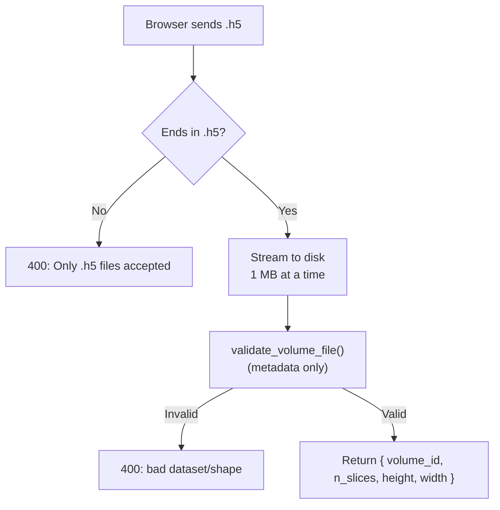
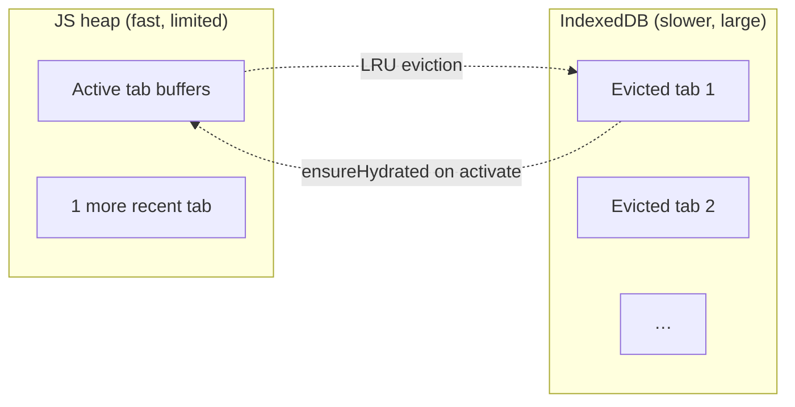

# Volume Ingestion & Storage

## Overview

Before Lumina can show or process a volume, it has to get the data into memory.
This document covers every path a volume can take into the system, the file
format it lives in, and the strategies both halves of the app use to avoid
running out of memory — these volumes are large (a standard volume is ~128 MB of
raw float data), so memory management is a recurring theme.

There are three ways a volume enters Lumina:

1. **Upload** — the browser sends an `.h5` file to the backend.
2. **Register by path** ("From server…") — the file already sits on the
   backend's disk, so the backend just makes a symbolic link to it instead of
   copying. This is instant and uses no extra disk.
3. **In-browser read** — for quick local viewing, the browser reads the `.h5`
   file itself (via h5wasm in a Web Worker) without involving the backend at all.

## The HDF5 file format

OCT volumes are stored as **HDF5** (`.h5`) files. HDF5 is a container format for
large numerical arrays. Lumina's convention is deliberately rigid so there is no
guessing:

| Property | Value |
|----------|-------|
| Dataset name | `"OCT"` (fixed) |
| Standard shape | `(512, 250, 250)` = (nSlices, height, width) |
| Accepted dtypes | float32/64, int16/32, uint8/16/32 (auto-converted to float32) |

Code: `backend/src/processing/h5_reader.py`, constant `OCT_DIMS = (512, 250, 250)`
at line 6.

### Reading functions

- **`load_volume(path)`** (`h5_reader.py:79`) — strict loader. Reads the `"OCT"`
  dataset, checks it has exactly `512·250·250 = 32,000,000` elements, and reshapes
  if the file stored it flat. Raises `ValueError` if the dataset is missing or
  the element count is wrong.
- **`load_volume_flexible(path)`** (`h5_reader.py:9`) — relaxed loader. Accepts
  *any* 3-D shape. This is needed because **merged (stitched) volumes are larger
  than the standard size** along height/width. It still reshapes a flat array to
  `(512, 250, 250)` when the element count happens to match.
- **`validate_volume_file(path)`** (`h5_reader.py:55`) — *metadata-only* check.
  It inspects `ds.shape`/`ds.size` without ever reading the ~128 MB of pixel data
  into RAM, so it is cheap enough to run on every upload. This is the key trick
  that makes upload validation fast.
- **`save_oct_volume(path, arr)`** (`h5_reader.py:40`) — writes an array back out
  as an `.h5` file with the standard `"OCT"` dataset (used for crops and merges).

**Edge case — flat vs 3-D:** some producers store the volume as one long 1-D
array of 32,000,000 numbers rather than a 3-D block. Both loaders detect this and
`reshape` to `(512, 250, 250)`, so either layout works.

## Path 1 — Upload

Endpoint: `POST /volumes/upload` (`backend/src/routers/volumes.py`).

The browser sends the raw `.h5` file. The challenge is that a naïve
implementation would buffer the entire ~128 MB file in RAM. Instead, the upload
is **streamed to disk in 1 MB chunks** (`UPLOAD_CHUNK_SIZE = 1024 * 1024`,
`volumes.py:28`), so peak memory stays around 1 MB no matter how big the file is.



The returned `volume_id` is the handle the frontend uses for every subsequent
operation (filter, crop, measure, …).

## Path 2 — Register by path (zero-copy)

Endpoints: `POST /volumes/register` and `POST /volumes/register-batch`
(`volumes.py`).

When the `.h5` files already live on the same machine as the backend, uploading
them would be wasteful. Instead the backend creates a **symbolic link** (a
filesystem pointer) inside its `uploads/` directory pointing at the original
file. No data is copied; registration is effectively instant.

Two safety properties matter here:

- **Read-only originals.** In Docker the data directory is bind-mounted
  read-only at `/data`, so originals can never be modified.
- **Path-traversal guard.** A user could try to register a path like
  `../../etc/passwd`. The backend resolves the requested path and checks
  `source.is_relative_to(root)` against `data_dir`; if it escapes, it returns
  `400 "Path escapes data_dir."` This prevents reading arbitrary files off the
  server.

`GET /volumes/local` lists the `.h5` files discovered under `data_dir` (returned
as relative path + filename), which is what populates the "From server…" browser.

**Volume-id derivation.** A file directly in `data_dir` keeps its filename stem
as id (`scan.h5` → `scan`). A file inside a subdirectory additionally gets a
short hash of its relative path (`a/scan.h5` → `scan-6bcf6a1d`-style): two tiles
named identically in different folders would otherwise collide on the id `scan`,
and the second registration would silently repoint the symlink under every open
tab still using the first file. The id is deterministic — registering the same
path twice returns the same id and reuses the same symlink.

### Configuration (`config.py`)

The backend's settings come from `backend/src/config.py` (a Pydantic
`BaseSettings` class):

| Setting | Env var | Default | Meaning |
|---------|---------|---------|---------|
| `uploads_dir` | — | `uploads` | Where uploaded/derived/result volumes are stored. |
| `data_dir` | `DATA_DIR` | `data` | Root of registerable source `.h5` files. |
| `cors_origins` | `CORS_ORIGINS` | `["http://localhost:5173"]` | Browser origins allowed to call the API. |

A small customization, `_CommaSepEnvSource` (`config.py:7`), lets `CORS_ORIGINS`
be a plain comma-separated string (e.g. `http://a.com,http://b.com`) instead of
requiring JSON — convenient for Docker.

In Docker Compose, the host directory of source files is chosen with the
`LUMINA_DATA_DIR` variable and mounted to `/data`. Set it in a **`.env` file next
to `docker-compose.yml`** (copy `.env.example` to `.env` and edit the path). Compose
loads `.env` automatically, so the same setup works on Windows, macOS, and Linux —
no inline shell variables (which only work in bash) required:

```bash
cp .env.example .env          # Windows: copy .env.example .env
# edit LUMINA_DATA_DIR in .env, then:
docker compose up --build
```

## Path 3 — In-browser read

For local files the frontend can skip the backend entirely and read the HDF5 in
the browser:

- `frontend/src/shared/h5/h5WorkerClient.ts` → `loadH5FileInWorker` hands the
  file to `h5.worker.ts`, a **Web Worker** (a background thread, so the UI never
  freezes); the actual h5wasm decode lives in `h5Reader.ts` and runs inside the
  worker.
- The worker uses **h5wasm** (a WebAssembly build of the HDF5 library) to read
  the `"OCT"` dataset, validates the dimensions, and converts whatever dtype it
  finds to `Float32Array`.
- It then calls `normalizeVolume` (`h5Normalizer.ts`) to produce the same
  three arrays the backend's packed format contains. See
  [doc 3](03-normalization-rendering.md) for that algorithm.

Constants for this path live in `frontend/src/shared/h5/h5Constants.ts`:
`VOLUME_DIMS = [512, 250, 250]`, `H5_DATASET_NAME = 'OCT'`, and
`PRE_FILTER_THRESHOLD = 0.05` (voxels dimmer than 5% of full scale are dropped
from the point cloud). The threshold value is deliberately mirrored on the
backend (`normalizer.py:33`) so both paths agree on what counts as "signal".

## Memory management

Because volumes are large, both sides aggressively limit how many live at once.

### Backend volume cache (`processing/volume_cache.py`)

When the same volume is loaded repeatedly (e.g. measure, then filter, then crop),
re-decoding the HDF5 each time is wasteful. The cache memoizes recently-loaded
volumes:

- **Key** = `(file path, file modification time)`. Including the mtime means an
  edited file is never served stale.
- **`_MAX_ENTRIES = 2`** — at most two volumes are kept resident.
- **`_MAX_CACHEABLE_BYTES = 256 MB`** — volumes larger than this (e.g. giant
  stitched montages) are *never* cached, so they don't sit in RAM.
- Eviction is **LRU** (least-recently-used): on a cache hit the entry is moved to
  the end; when the cache overflows, the oldest entry is dropped.

`load_volume_cached(path, loader)` wraps any loader function with this behaviour;
`clear()` empties it (called by the cleanup endpoint and by tests).

### Frontend two-tier memory (heap + IndexedDB)

The browser has even tighter limits — keeping every open tab's buffers on the JS
heap would crash the page. The strategy (in `app/store/viewerSlice.ts` and
`shared/h5/volumeCache.ts`):



- At most **`MAX_HYDRATED_FILES` (2)** volumes keep their heavy buffers
  (`vIndices`, `vIntensities`, `normalizedVolume`, ~150–210 MB each) on the JS
  heap at once.
- Inactive tabs are **evicted to IndexedDB** (an in-browser database for large
  binary blobs). Their tab entry keeps lightweight `meta` (dimensions) and a
  `hasSlices` flag, but `data` becomes `null`.
- When a user re-activates an evicted tab, **`ensureHydrated`** restores the
  buffers from IndexedDB.
- Volumes over ~512 MB (huge stitches) stay **resident-only** — they are never
  written to IndexedDB (to respect its size ceiling) but also can't be evicted.
- `putVolume` / `getVolume` / `deleteVolume` / `clearVolumes` in
  `volumeCache.ts` are the IndexedDB operations; restore is zero-copy (the
  typed-array views are re-wrapped over the restored buffer).

This bounds heap growth so opening many files — or a whole folder — no longer
crashes the tab. Filtered results are re-persisted on apply so eviction never
loses processed data.

## Cleanup

`DELETE /cleanup` (`routers/cleanup.py`) removes everything in `uploads_dir` and
clears the backend volume cache. It deletes symlinks safely: calling `unlink()`
on a symlink removes only the link, never the original file it points at — so
registered source volumes under `data_dir` are untouched.

## Inputs, outputs, and error cases

| Operation | Input | Output | Notable errors |
|-----------|-------|--------|----------------|
| Upload | `.h5` file (multipart) | `{ volume_id, n_slices, height, width }` | 400 non-`.h5`; 400 bad dataset/shape |
| Register | relative path string | `{ volume_id, … }` | 400 escapes data_dir; 400 non-`.h5`; 404 not found |
| Register batch | list of paths | list of upload responses | per-file as above |
| List local | — | list of `{ path, name }` | — |
| Cleanup | — | `{ deleted, errors }` | — |

## Related documents

- The normalization that turns a loaded volume into render-ready data:
  [Normalization, Point-Cloud Rendering & Shaders](03-normalization-rendering.md).
- The full endpoint reference: [API Reference](12-api-reference.md).
