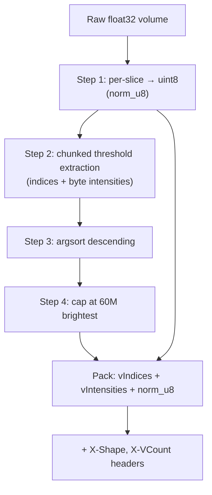

# Normalization, Point-Cloud Rendering & Shaders

## Overview

Raw OCT intensities are arbitrary floating-point numbers — their absolute scale
varies between scans and even between slices. Before anything can be displayed,
the data must be **normalized** to a predictable `[0, 1]` range, and the
brightest voxels must be extracted and sorted so the 3-D view can draw them
efficiently. This document explains:

- How the backend turns a raw volume into the **packed binary** (introduced in
  [doc 1](01-architecture-overview.md)).
- How the frontend does the equivalent work for locally-read files, using a fast
  **radix sort**.
- How the GPU **shaders** turn the point cloud into pixels: decoding voxel
  positions, applying colormaps, tone mapping, and depth coloring.

"Normalize" here means: rescale numbers so the smallest becomes 0 and the
largest becomes 1 (or 0–255 for a byte), so they can be drawn as brightness.

## Backend normalization — `normalize_for_frontend`

File: `backend/src/processing/normalizer.py:48`.

This function takes a raw float32 volume and returns the three arrays of the
packed format: `(vIndices, vIntensities, normalizedVolume_u8)`. It is written to
be memory-frugal, because a careless version would allocate several full-volume
copies.

### Step 1 — Per-slice normalization to bytes

Each slice is independently rescaled to the 0–255 range. For slice *s* with
minimum `mn` and maximum `mx`:

```text
scale = 255 / (mx − mn)          (or 0 if the slice is flat, mx == mn)
output(pixel) = clip( (pixel − mn) · scale , 0, 255 )
```

- **`pixel`** — the raw intensity of one voxel.
- **`mn`, `mx`** — the dimmest and brightest values *in that slice*.
- **`scale`** — the factor that stretches `[mn, mx]` onto `[0, 255]`.
- **`clip(…, 0, 255)`** — clamp out-of-range values (guards against rounding).

**Why per-slice?** OCT signal often fades with depth; normalizing each slice on
its own keeps deep slices visible instead of letting a few bright shallow slices
dominate. (The trade-off — slice-to-slice flicker — is handled differently by
the edge filter; see [doc 4](04-preprocessing-filters.md).)

**Memory trick:** only one reusable `float32` scratch slice (`tmp`) is allocated
(`normalizer.py:82`), filled in place with `np.subtract`/`np.multiply`/`np.clip`,
then copied into the `uint8` output. This avoids a full 256 MB float copy of the
whole volume.

**Worked example.** A slice has `mn = 10`, `mx = 210`. Then
`scale = 255 / (210 − 10) = 255 / 200 = 1.275`. A voxel with raw value 110 maps
to `(110 − 10) · 1.275 = 100 · 1.275 = 127.5`, rounded to **128** — mid-gray, as
expected for a mid-range value.

### Step 2 — Chunked above-threshold extraction

Only voxels brighter than the threshold (default `PRE_FILTER_THRESHOLD = 0.05`,
i.e. `threshold_u8 = round(0.05 · 255) = 13`) become point-cloud entries. To
avoid building one giant boolean mask over the entire volume (which for a big
merge could be ~250 MB), the volume is processed in **chunks of 32 slices**
(`CHUNK = 32`, `normalizer.py:98`). For each chunk it records the flat indices of
above-threshold voxels and their byte intensities. Indices use `int32` (half the
size of `int64`), safe for volumes up to ~2 billion voxels.

### Step 3 — Sort brightest-first

```text
order = argsort(intensities)[::-1]      # ascending sort, then reversed
```

The voxels are sorted by intensity **descending** (brightest first). Sorting is
done on the `uint8` intensities — only 256 distinct values — which is 3–5× faster
than sorting floats and uses a quarter of the temporary memory.

**Why descending?** Two reasons: (a) the 3-D renderer can draw "the brightest N
voxels" simply by taking a prefix of the array; (b) if the point cloud is too
large, the dim tail can be dropped (next step).

### Step 4 — Cap the point cloud

```text
MAX_POINTCLOUD_VOXELS = 60,000,000
if count > MAX: keep only the first MAX (brightest) entries
```

For a large stitched montage, per-slice normalization can push *almost every*
voxel above threshold, producing 200 M+ entries (1.5 GB+ of float data) — far
beyond useful render density and enough to crash a browser tab. Because the array
is already sorted brightest-first, truncating to the brightest 60 M keeps every
meaningful voxel and discards only the dim noise tail. Crucially, the
**full-resolution `normalizedVolume` is never truncated**, so the 2-D slice
viewer and measurements still see every voxel.

The final outputs:

- `v_indices = raw_idx[order]` as `float32`.
- `v_intensities = raw_int[order] / 255.0` as `float32` (back to `[0, 1]`).
- `norm_u8` — the full `(nSlices, H, W)` byte volume from Step 1.

### Packing and caching

- **`pack_normalized_response(vol)`** (`normalizer.py:148`) calls
  `normalize_for_frontend`, concatenates the three arrays' bytes, and returns
  `(content, headers)` with `X-Shape` and `X-VCount` set.
- **`save_packed` / `load_packed`** (`normalizer.py:177`, `:208`) write/read the
  packed bytes to a `.bin` file plus a `.json` of the headers. The stitching
  session runner pre-computes the merged volume's packed binary this way so the
  download endpoint just serves a file instead of recomputing.



## Frontend normalization — `normalizeVolume` (radix sort)

File: `frontend/src/shared/h5/h5Normalizer.ts:7`.

For locally-read files (Path 3 in [doc 2](02-volume-ingestion-storage.md)) the
browser produces the same three arrays. The algorithm mirrors the backend but
sorts with a hand-written **radix sort** (a fast non-comparison sort) because
JavaScript's built-in sort is comparison-based and slow on millions of elements.

### The passes

1. **Pass 1** — compute each slice's min/max (stored in small typed arrays), then
   count exactly how many voxels are above threshold, so the output buffers can
   be allocated at the exact size.
2. **Pass 2** — fill `normalizedVolume` (Uint8, 0–255) for *every* voxel, and the
   `tmpIndices`/`tmpIntensities` for above-threshold voxels. Per-voxel
   normalization is `(raw − mn) / range`, where `range = mx − mn` (or 1 if the
   slice is flat).
3. **Radix sort** — sort the above-threshold voxels by intensity, descending.

### The radix-sort key

```text
sortKey = ~round(intensity · 0xFFFFFF) & 0xFFFFFF
```

- **`intensity`** — normalized value in `[0, 1]`.
- **`· 0xFFFFFF`** — scale to a 24-bit integer (`0xFFFFFF = 16,777,215`), giving
  fine resolution.
- **`~` (bitwise NOT) then `& 0xFFFFFF`** — flips the bits within 24 bits, which
  *inverts the ordering*. Sorting these keys ascending therefore yields the
  original intensities **descending** — the brightest-first order the renderer
  wants — without a separate reversal step.

The sort itself is two **12-bit passes** (`BITS = 12`, `BUCKETS = 4096`): a
counting sort on the low 12 bits, then on the high 12 bits. This is `O(n)` and
processes the full 24-bit key. The result is a permutation array `perm` used to
gather `vIndices` and `vIntensities` into final order.

**Worked example of the key.** An intensity of `1.0` gives
`round(1.0 · 16777215) = 16777215 = 0xFFFFFF`; `~0xFFFFFF & 0xFFFFFF = 0`. An
intensity of `0.0` gives key `0xFFFFFF`. So the brightest voxel gets the smallest
key (0) and sorts first — exactly the descending order we want.

## GPU rendering — the shaders

File: `frontend/src/features/h5/h5ViewerShaders.ts`. These are **GLSL** programs
(the language GPUs run) used by the Three.js point-cloud viewer (`H5Viewer.tsx`).
Each point-cloud vertex carries just two numbers: its flat index `vIndex` and its
intensity `vIntensity`.

### Vertex shader — decoding position

The vertex shader runs once per voxel and computes where to draw it. First it
reverses the flat-index packing (the same `flatIndex = s·H·W + y·W + x` from
[doc 1](01-architecture-overview.md)):

```glsl
sliceSize = uHeight * uWidth;
s   = floor(vIndex / sliceSize);     // which slice
rem = mod(vIndex, sliceSize);
h   = floor(rem / uWidth);           // row
w   = mod(rem, uWidth);              // column
```

Then it maps voxel coordinates to centered world coordinates:

```glsl
x = w - uWidth  * 0.5;
y = (s - uNSlices * 0.5) * (uVolumeSpacing / uNSlices);
z = h - uHeight * 0.5;
```

- **`x`, `z`** — column/row, shifted so the volume is centered on the origin.
- **`y`** — the slice axis, but **stretched** by the factor
  `uVolumeSpacing / uNSlices`. `uVolumeSpacing` is a user slider (default 250):
  it controls how "tall" the stack appears. Multiplying each slice position by
  `uVolumeSpacing / uNSlices` spreads the 512 slices across `uVolumeSpacing`
  scene units, so the display can be made isotropic (cubical voxels) regardless
  of slice count.

**Worked example.** With `uWidth = 250`, a voxel at column `w = 125` maps to
`x = 125 − 125 = 0` (dead center). With `uNSlices = 512` and `uVolumeSpacing = 250`,
slice `s = 256` maps to `y = (256 − 256) · (250/512) = 0` (also center), and the
top slice `s = 511` maps to `y = (511 − 256) · 0.488 ≈ 124.5`.

### Fragment shader — color and brightness

The fragment shader runs per drawn point and decides its final color. It first
**discards** (skips) voxels that should not be visible:

```glsl
if (fIntensity < uThreshold) discard;       // too dim
if (fS < uSliceMin || fS >= uSliceMax) discard;   // outside Z clip range
if (fW < uWidthMin || fW >= uWidthMax) discard;   // outside X clip range
if (fH < uHeightMin || fH >= uHeightMax) discard; // outside Y clip range
```

This is how the clipping sliders work: they simply narrow the allowed ranges.

For surviving voxels it computes a color parameter `t ∈ [0, 1]` in one of two
modes:

**Intensity mode (auto-fit window).**

```glsl
visible = clamp((fIntensity - uIntensityFloor) /
                max(uIntensityCeil - uIntensityFloor, 0.001), 0, 1);
c = clamp(visible * uBrightness, 0, 1);
if (c < 0.5) c = 0.5 * pow(2*c, uContrast);
else         c = 1.0 - 0.5 * pow(2*(1-c), uContrast);
t = clamp((c - uColormapMin) / span, 0, 1);
```

The key idea is **auto-fit**: because only above-threshold voxels are drawn, the
visible intensities live in a narrow band `[uIntensityFloor, uIntensityCeil]`.
Stretching exactly that band across the full color scale means brighter voxels
always look visibly hotter, instead of all collapsing into the top sliver of the
range. `uIntensityFloor`/`uIntensityCeil` are computed from percentiles (the
2nd and 98th) of the visible voxels at load time (`H5Viewer.tsx`).

**Depth mode (`uColorByDepth == 1`).** Instead of intensity, `t` comes from the
slice position within the visible range, so color encodes depth:

```glsl
t = clamp((fS - uSliceMin) / max(uSliceMax - uSliceMin, 1), 0, 1);
```

### The tone-mapping curve

This S-shaped curve (used both in the shader and on the CPU for slices, see
[doc 5](05-slice-viewer-measurements.md)) adjusts contrast around the midpoint
`0.5`:

```text
if c < 0.5:  c = 0.5 · (2c)^contrast
else:        c = 1 − 0.5 · (2(1−c))^contrast
```

- **`contrast = 1`** leaves values unchanged (a straight line).
- **`contrast > 1`** pushes mid-tones toward the extremes (darks darker, brights
  brighter) — more contrast.
- **`contrast < 1`** flattens — less contrast.

It is symmetric about `0.5`, so it never shifts the overall brightness, only the
distribution. **Worked example** with `contrast = 2` and `c = 0.25` (a dark
midtone): since `0.25 < 0.5`, `c = 0.5 · (2·0.25)^2 = 0.5 · 0.5² = 0.5 · 0.25 = 0.125`
— the value is pushed darker, increasing contrast.

### Colormaps

Two analytic colormaps map `t ∈ [0, 1]` to RGB. **Jet** (blue→cyan→green→
yellow→red):

```glsl
r = clamp(1.5 − |4t − 3|, 0, 1)
g = clamp(1.5 − |4t − 2|, 0, 1)
b = clamp(1.5 − |4t − 1|, 0, 1)
```

Each channel is a triangular bump centered at a different `t`, so the dominant
color sweeps across the spectrum as `t` rises. **Hot** (black→red→yellow→white):

```glsl
r = clamp(3t,     0, 1)   // red rises first
g = clamp(3t − 1, 0, 1)   // green joins at t = 1/3
b = clamp(3t − 2, 0, 1)   // blue joins at t = 2/3
```

**Gray** is the default: the point is drawn pure white and `t` drives the *alpha*
(opacity), so brightness/contrast control apparent density.

**Worked example (Jet at `t = 0.5`):** `r = 1.5 − |2−3| = 1.5 − 1 = 0.5`,
`g = 1.5 − |2−2| = 1.5` → clamped to `1`, `b = 1.5 − |2−1| = 0.5`. RGB ≈
`(0.5, 1, 0.5)` — a green, which is the middle of the Jet scale, as expected.

### Object-overlay shaders

A second shader pair (`objectOverlayVertexShader` / `objectOverlayFragmentShader`)
draws the colored voxels of counted objects (see
[doc 6](06-cropping-object-analysis.md)) on top of the cloud, applying the *same*
threshold and clip-range discards so only currently-visible voxels are tinted.

## Drawing only the visible voxels — `h5DrawUtils.ts`

File: `frontend/src/features/h5/h5DrawUtils.ts`.

Because `vIntensities` is sorted descending, "how many voxels are above the
threshold" is found with a **binary search** for the threshold's position
(`countAboveThreshold`). `applyDrawRanges` then sets each geometry chunk's
`setDrawRange(...)` so the GPU only iterates the visible prefix — moving the
threshold slider becomes nearly free. (The cloud is split into chunks of at most
~28 M vertices per draw call to respect browser/GPU limits.)

## Summary of the formulas

| Formula | Where | Purpose |
|---------|-------|---------|
| `scale = 255/(mx−mn)`, `clip((p−mn)·scale,0,255)` | normalizer.py:88 | Per-slice byte normalization |
| `argsort(intensity)[::-1]` | normalizer.py:117 | Brightest-first ordering |
| `~round(i·0xFFFFFF) & 0xFFFFFF` | h5Normalizer.ts:75 | Radix-sort descending key |
| `flatIndex = s·H·W + y·W + x` | shaders / CPU | 3-D ↔ 1-D index mapping |
| `y = (s − N/2)·(spacing/N)` | shaders:23 | Slice-axis world stretch |
| S-curve tone map | shaders:163, SlicePanel.tsx:96 | Contrast adjustment |
| Jet / Hot channel ramps | shaders:124, SlicePanel.tsx:104 | Colormaps |

## Related documents

- The 2-D version of tone mapping and colormaps:
  [2-D Slice Viewer & Geometric Measurements](05-slice-viewer-measurements.md).
- Where the packed binary is produced and consumed:
  [Volume Ingestion & Storage](02-volume-ingestion-storage.md) and
  [Jobs, Sessions & the Async Processing Lifecycle](09-jobs-sessions-lifecycle.md).
