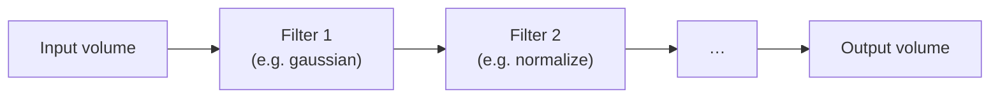
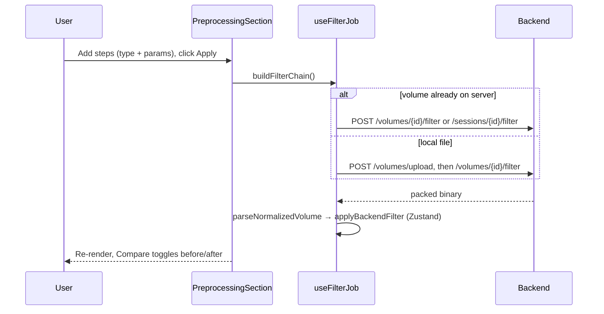

# Preprocessing Filters

## Overview

Filters clean up or transform a volume before viewing or measuring it — removing
noise, smoothing, normalizing brightness, or highlighting edges. Lumina offers
five filters that can be **chained**: the output of one becomes the input of the
next, in the order the user arranges them. All filtering happens on the backend;
the frontend builds the chain in a small UI and gets back a render-ready packed
binary.

The five filter types are `gaussian`, `median`, `mean`, `normalize`, and `edge`.

Code: `backend/src/processing/filters.py`. UI: `PreprocessingSection.tsx`,
`useFilterParams.ts`, `useFilterJob.ts` (all in `frontend/src/features/controls/`).

## How a filter chain runs

`apply_filter_chain(volume, chain, *, copy_input=True)` (`filters.py:127`) walks
the chain in order. Each step is a dict `{"type": str, "params": dict}`; the type
is looked up in `_FILTER_REGISTRY` (`filters.py:118`) and called with the params.
An unknown type raises `ValueError`.



The `copy_input` flag is a memory optimization: when the caller owns a temporary
volume (e.g. one just loaded from disk for this request only), it passes
`copy_input=False` to skip a defensive ~128 MB copy.

Most filters work **slice by slice** (a loop over `volume.shape[0]`), so only one
2-D slice is processed at a time — this keeps memory low. The `normalize` filter
is the exception: it works across the whole volume.

## The five filters

### 1. Gaussian blur (`apply_gaussian`, `filters.py:10`)

Smooths each slice by replacing every pixel with a weighted average of its
neighbours, where the weights follow a 2-D Gaussian ("bell curve"):

$$G(x,y) = \frac{1}{2\pi\sigma^2}\,\exp\!\left(-\frac{x^2+y^2}{2\sigma^2}\right)$$

- **`x`, `y`** — offset (in pixels) from the pixel being computed.
- **`σ` (sigma)** — the blur radius. Larger σ averages over a wider area → more
  blur. Default `1.0`.
- The fraction out front normalizes the weights so they sum to 1 (the image's
  overall brightness is preserved).

Implementation: `scipy.ndimage.gaussian_filter(slice, sigma)`. Good for gentle,
isotropic (same in all directions) noise reduction.

**Worked intuition.** With `σ = 1`, a pixel's value is dominated by itself and
its immediate neighbours, with rapidly shrinking contributions further out — a
subtle smoothing. With `σ = 5`, neighbours up to ~10–15 pixels away contribute
meaningfully, producing a strong blur.

### 2. Median filter (`apply_median`, `filters.py:27`)

Replaces each pixel with the **median** (middle value) of its `size × size`
neighbourhood. Default `size = 3` (a 3×3 window).

Unlike averaging, the median is **non-linear** and excellent at removing
"salt-and-pepper" noise (isolated black/white speckles) *without blurring edges*,
because a lone outlier can never be the median of its neighbourhood.

**Worked example.** A 3×3 window holds the values
`[20, 22, 21, 250, 23, 22, 20, 21, 22]` (one bright speckle of 250). Sorted:
`[20, 20, 21, 21, 22, 22, 22, 23, 250]`; the median (5th of 9) is `22`. The
speckle is erased and replaced by the local tissue value — a mean filter would
instead have smeared it into a gray blob.

### 3. Mean filter (`apply_mean`, `filters.py:44`)

Replaces each pixel with the simple **average** of its `size × size`
neighbourhood (`scipy.ndimage.uniform_filter`). Default `size = 3`. This is the
simplest linear smoothing — fast, but it blurs edges and does not handle
salt-and-pepper noise as gracefully as the median.

### 4. Percentile normalize (`apply_normalize`, `filters.py:61`)

Rescales intensities to `[0, 1]` based on **percentiles** rather than absolute
min/max, so a few extreme outlier pixels don't dictate the whole range:

$$x_\text{norm} = \text{clip}\!\left(\frac{x - p_\text{low}}{p_\text{high} - p_\text{low}},\ 0,\ 1\right)$$

- **`x`** — a voxel's intensity.
- **`p_low`** — the value at the low percentile (default 1st percentile): 1% of
  voxels are dimmer than this.
- **`p_high`** — the value at the high percentile (default 99th): 1% of voxels
  are brighter.
- **`clip(…, 0, 1)`** — anything below `p_low` becomes 0, anything above
  `p_high` becomes 1.

If `p_high ≤ p_low` (a flat volume) it returns all zeros. Parameters:
`low_percentile` (default 1.0), `high_percentile` (default 99.0).

**Why percentiles?** A single dead-hot pixel (value 60000 in a 0–300 volume) would
crush a min/max normalization so all real tissue sits near zero. Using the 99th
percentile ignores that outlier and keeps the real range usable.

**Worked example.** Suppose the 1st percentile is `p_low = 5` and the 99th is
`p_high = 205`. A voxel of value `105` maps to
`(105 − 5) / (205 − 5) = 100 / 200 = 0.5`. A voxel of `400` (a hot outlier) maps
to `(400 − 5)/200 = 1.975` → clipped to `1.0`.

### 5. Edge highlight (`apply_edge_highlight`, `filters.py:81`)

Highlights structural boundaries — places where intensity changes sharply, such
as tissue interfaces. It computes the **gradient magnitude** (how steeply
brightness changes) per slice using **Sobel operators**, then normalizes the
result to `[0, 1]`.

The algorithm, per slice:

1. **Optional Gaussian pre-smoothing** with `sigma` (default `1.0`; set `0` to
   disable). Derivatives amplify noise, so smoothing first prevents the edge map
   from being dominated by speckle.
2. **Sobel gradients** in both in-plane directions:
   `sx = sobel(plane, axis=0)`, `sy = sobel(plane, axis=1)`. Sobel is a small
   convolution that estimates the rate of change along one axis.
3. **Gradient magnitude:**

   $$M(y,x) = \sqrt{s_x(y,x)^2 + s_y(y,x)^2}$$

   computed as `np.hypot(sx, sy)`. This combines the horizontal and vertical
   change into a single "edge strength", regardless of edge orientation.

4. **Global percentile normalization** across the *whole volume*:

```text
ref = percentile(M_allslices, high_percentile)     # default 99th
M_norm = clip(M / ref, 0, 1)
```

- **`M`** — the gradient-magnitude volume.
- **`ref`** — the 99th-percentile magnitude over the entire volume.
- Dividing by `ref` (not the maximum) means one freakishly strong edge can't wash
  everything else out, and using a *global* reference keeps brightness consistent
  from slice to slice (no flicker while scrolling). Parameters: `sigma`
  (default 1.0), `high_percentile` (default 99.0).
- **Degenerate-input fallback:** if fewer than 1 % of all voxels carry any edge
  signal (e.g. a tiny bright object in an otherwise empty volume), the 99th
  percentile is `0`. In that case `ref` falls back to the absolute maximum
  `M.max()` so the output always stays inside `[0, 1]` as documented.

**Why this design (the recent improvement).** An earlier version used
`magnitude / magnitude.max()` per slice, which (a) collapsed real edges to near
zero whenever a single hot pixel existed, and (b) made each slice's contrast
independent, causing flicker. Pre-smoothing + global percentile normalization
fixes both. The defaults are strong enough that the filter is still called with
empty params from the UI and simply looks better — no UI change required.

**Worked example.** Imagine a slice that is flat gray `100` on the left half and
flat gray `180` on the right half. The Sobel horizontal derivative is ~0
everywhere except along the boundary column, where it is large (proportional to
the `80`-unit jump). After magnitude + normalization, the boundary appears as a
bright line on a black background — the edge is "highlighted".

## Keeping outputs stackable

Every filter returns the same shape and dtype it received, and the value range
stays compatible with the next stage. `normalize` and `edge` both produce `[0, 1]`
output, so they can sit anywhere in a chain without breaking the renderer's
expectations.

## The frontend filter UI



- **`useFilterParams.ts`** (`usePipeline`) manages the per-file list of
  `PipelineStep`s — add, remove, reorder, change type, change a param — and
  `buildFilterChain()` converts the UI steps to the API's `FilterStep[]`. Default
  params: `gaussianSigma = 1.5`, `medianRadius = 3`, `meanSize = 3`,
  `normalizeLow = 2.0`, `normalizeHigh = 98.0`.
- **`useFilterJob.ts`** runs the apply/revert. It picks the cheapest route:
  session-merged volumes use `/sessions/{id}/filter`; already-registered or
  uploaded volumes use `/volumes/{id}/filter` (no re-upload); only a purely local
  file is uploaded first. The result is stored via `applyBackendFilter` and
  re-persisted to IndexedDB so eviction never loses it.
- **Before/after compare** — `saveFilterSnapshot` keeps the pre-filter volume so
  the user can A/B compare (`showingComparison`) and revert without recomputing.
- Slider ranges come from `RENDER_CONTROL_LIMITS` (`renderControlLimits.ts`):
  Gaussian σ ∈ [0.5, 5]; median/mean sizes are odd values in [3, 9].

> **Note:** A separate, heavier `/jobs/` create-and-poll pipeline also exists (it
> runs filters *and* stitchers and computes metrics) but the preprocessing UI no
> longer uses it — it uses the lean single-request `/filter` endpoints. The job
> pipeline is covered in [doc 9](09-jobs-sessions-lifecycle.md).

## Inputs, outputs, edge cases

| Filter | Params (defaults) | Output range | Edge cases |
|--------|-------------------|--------------|-----------|
| gaussian | `sigma` (1.0) | unchanged | σ=0 ≈ no-op |
| median | `size` (3) | unchanged | even sizes work but odd is conventional |
| mean | `size` (3) | unchanged | larger size = more blur |
| normalize | `low_pct` (1.0), `high_pct` (99.0) | `[0, 1]` | flat volume → all zeros |
| edge | `sigma` (1.0), `high_pct` (99.0) | `[0, 1]` | `sigma=0` disables smoothing; flat volume → all zeros |

## Related documents

- The normalization that always runs *after* filtering to build render data:
  [Normalization, Point-Cloud Rendering & Shaders](03-normalization-rendering.md).
- The metrics computed when filters run inside a stitcher comparison job:
  [Multi-Volume Stitching & Registration](08-stitching-registration.md).
