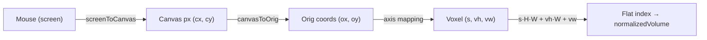
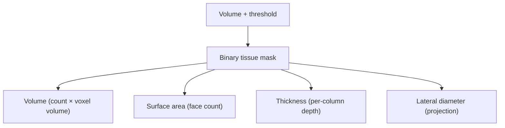

# 2-D Slice Viewer & Geometric Measurements

## Overview

OCT data is 3-D, but clinicians and researchers often want to look at flat
cross-sections and take precise measurements. Lumina's **2-D slice viewer** shows
three orthogonal cuts through the volume, each in its own zoomable/pannable panel,
with brightness/contrast controls, an interactive measurement tool, and a
physical scale bar. Separately, the backend can compute **volumetric
measurements** of the imaged tissue (volume, surface area, thickness, diameter).

This document covers:

- The slice viewer layout and the single-panel canvas (`SlicePanel.tsx`).
- The coordinate transforms that connect mouse clicks to voxels.
- The on-canvas **distance** and **area** measurement formulas.
- The backend **geometric measurement** formulas (`measurements.py`).

## The three panels

`H5SliceViewer.tsx` hosts three `SlicePanel` instances, one per axis:

| Panel | Fixed axis | Plane shown | What you scroll through |
|-------|-----------|-------------|-------------------------|
| Z | slice index | XY (a single slice face) | depth (slices 0–511) |
| Y | row | XZ | rows (0–249) |
| X | column | YZ | columns (0–249) |

Each panel reads the full `normalizedVolume` (the byte array from
[doc 3](03-normalization-rendering.md)) and draws the current slice onto an HTML
canvas. Per-panel brightness/contrast live in the Zustand store
(`slicePanelControls[axis]`).

## Drawing a slice

For each output canvas pixel `(nx, ny)`, `SlicePanel` figures out which voxel it
represents, looks up that voxel's byte value in `normalizedVolume`, and runs it
through a 256-entry **lookup table (LUT)** that bakes in tone mapping + colormap +
range windowing. Building the color once per byte value (256 entries) instead of
per pixel is a big speed win.

- **Tone mapping** — `applyToneMap(value, brightness, contrast)`
  (`SlicePanel.tsx:94`) is the CPU twin of the GPU S-curve from
  [doc 3](03-normalization-rendering.md): `c = min(value·brightness, 1)`, then the
  same symmetric curve around the pivot `0.5`.
- **Colormap** — `colormapRGB(t, colormap)` (`SlicePanel.tsx:101`) implements the
  same Jet / Hot / Gray maps as the shader.
- **Range window** — the colormap range `[rangeMin, rangeMax]` remaps `t` so the
  user can stretch a sub-range across the full color scale.

Drawing is wrapped in `requestAnimationFrame` so rapid slider changes coalesce
into one repaint.

## Orientation and the coordinate transforms

Different panels display the volume face rotated or flipped so anatomy appears
consistently. The optional `orient` prop is one of `'ccw90'`, `'flipH'`,
`'flip180'`, or undefined. Three pure functions convert between coordinate spaces,
and getting these right is what makes measurements accurate.

The spaces are:

1. **Screen** — pixels relative to the panel container, where the mouse lives.
2. **Canvas** — pixels on the (possibly zoomed/panned/CSS-scaled) canvas.
3. **Orig** — the pre-orientation voxel coordinates of the displayed face.

### `screenToCanvas` (`SlicePanel.tsx:126`)

Converts a mouse position to canvas-pixel coordinates, undoing zoom, pan, and the
CSS-vs-pixel size difference:

```text
mx = sx − containerW/2
my = sy − containerH/2
cx = ((mx − panX) / zoom) · (canvasW / cssDW) + canvasW/2
cy = ((my − panY) / zoom) · (canvasH / cssDH) + canvasH/2
```

- **`sx, sy`** — mouse position inside the container.
- **`panX, panY`, `zoom`** — current pan offset and zoom factor.
- **`canvasW/cssDW`** — ratio between the canvas's true pixel width and its
  displayed CSS width. Without this correction, clicks are offset (most visibly on
  the tall YZ panel where `canvasH = 512`).

### `canvasToOrig` (`SlicePanel.tsx:166`) and `origToCanvas` (`:148`)

These apply (and invert) the orientation transform. For example, for `'ccw90'`
(rotate 90° counter-clockwise):

```text
canvasToOrig:  ox = origW − 1 − cy,   oy = cx
origToCanvas:  cx = oy,               cy = origW − 1 − ox
```

The other orientations are simple flips (`flipH` mirrors x; `flip180` mirrors both
x and y); undefined is the identity.

### From orig coords to a voxel

Inside the draw loop, the `(ox, oy)` of a pixel plus the panel's axis pick the
voxel `(s, vh, vw)`:

- **Z panel:** `s = sliceIndex`, `vh = oy`, `vw = ox`.
- **Y panel:** `s = oy`, `vh = sliceIndex`, `vw = ox`.
- **X panel:** `s = ox`, `vh = oy`, `vw = sliceIndex`.

and the flat index is `volIdx = s·(H·W) + vh·W + vw`.



## Measurement tool — distance and area

A toolbar button toggles **measuring** mode per panel; a second button switches
between **distance** (two points) and **area** (drag a rectangle). The two tools
share the same voxel-spacing math but produce a length vs. an area.

The physical voxel spacing `[dz, dy, dx]` (µm/voxel, default `[5.19, 20, 20]` —
axial 5.19, lateral 20) and `UM_PER_MM = 1000` come from
`frontend/src/shared/constants.ts`.

### Distance — `computeDistanceMm` (`SlicePanel.tsx:181`)

The user clicks two points. Each click is converted to orig coords (`r1`, `r2`),
the in-plane displacement is converted from voxels to micrometres using the *two
spacings that apply to that panel's plane*, and the Euclidean distance is divided
by 1000 to get millimetres:

$$\text{distance}_{mm} = \frac{\sqrt{(\Delta_1\,\text{µm})^2 + (\Delta_2\,\text{µm})^2}}{1000}$$

where the two axis displacements depend on the panel:

| Panel | plane | `Δ₁ (µm)` | `Δ₂ (µm)` |
|-------|-------|-----------|-----------|
| Z | XY | `(r2.ox − r1.ox)·dx` | `(r2.oy − r1.oy)·dy` |
| Y | XZ | `(r2.ox − r1.ox)·dx` | `(r2.oy − r1.oy)·dz` |
| X | YZ | `(r2.ox − r1.ox)·dz` | `(r2.oy − r1.oy)·dy` |

- **`r1, r2`** — the two clicked points in orig voxel coordinates.
- **`dx, dy, dz`** — physical voxel spacing along each axis.
- The horizontal and vertical screen axes map to *different* volume axes
  depending on the panel, which is why each row uses a different spacing pair.

**Worked example (Z panel, default lateral 20 µm spacing).** Click at orig `(50, 40)`
and `(110, 120)`. The Z panel's XY plane uses `dx = dy = 20`: `Δ₁ = (110−50)·20 =
1200 µm`, `Δ₂ = (120−40)·20 = 1600 µm`. Distance `= √(1200² + 1600²) / 1000 =
√(1,440,000 + 2,560,000)/1000 = √4,000,000/1000 = 2000/1000 = 2.000 mm`. The
readout shows `2.000 mm`.

### Area — `computeAreaMm2` (`SlicePanel.tsx:213`)

The user drags a rectangle. Its two edges are parallel to the orig axes, so each
edge length maps to exactly one spacing, and the area in mm² is:

$$\text{area}_{mm^2} = \frac{w_{\text{µm}} \cdot h_{\text{µm}}}{1000 \times 1000}$$

with `w_µm` and `h_µm` computed like `Δ₁`/`Δ₂` above (using absolute values), per
panel. Dividing by `1000²` converts µm² to mm².

**Worked example (Z panel).** A rectangle 60 voxels wide and 80 tall at the lateral
20 µm/voxel: `w_µm = 60·20 = 1200`, `h_µm = 80·20 = 1600`. Area `= (1200·1600)/1,000,000 =
1,920,000/1,000,000 = 1.920 mm²`. The readout shows `1.920 mm²`.

### Interaction details

- Distance points are placed by *clicking* (a press that moves less than
  `CLICK_DRAG_TOLERANCE_PX = 5` px). A drag instead pans, so you can still
  reposition while measuring.
- Area is a *drag*: press-move-release draws the rectangle live; a negligible drag
  (≤ `MIN_CROP_DRAG_PX = 2`) is treated as a stray click and discarded.
- Measurement overlays use a thick stroke (`MEASURE_LINE_WIDTH = 4`, divided by
  the zoom so it stays a constant on-screen thickness) for visibility.
- Switching slices clears the current measurement (the old points no longer apply
  to the new slice) — done in the render phase to avoid a double render.

## The scale bar

Each panel draws horizontal and vertical scale bars sized to a "nice" round
physical length. `scaleBarUm(targetPx, umPerPx)` (`SlicePanel.tsx:258`) targets
~28% of the canvas dimension, then snaps down to the nearest value in
`SCALE_NICE_UM = [10, 20, 25, 50, 100, 200, 250, 500, 1000, 2000, 2500, 5000]` µm.
`formatScaleUm` prints it as e.g. `250 µm` or `1 mm`. The per-panel µm/pixel
depends on which axes the panel shows (`hUmPerPx`/`vUmPerPx` at `SlicePanel.tsx:657`).

## Backend geometric measurements — `compute_measurements`

File: `backend/src/processing/measurements.py:9`. Endpoint:
`POST /volumes/{id}/measure`. This quantifies the *tissue* in a volume by first
turning intensity into a yes/no **mask**, then measuring that mask. Inputs: a
`threshold` (default 0.05) and `voxel_size_um = (dz, dy, dx)` (default
`(1, 1, 1)`).

The tissue mask is simply every voxel brighter than the threshold:
`mask = volume > threshold`.



### Volume (`measurements.py:39`)

```text
voxel_count   = number of True voxels in the mask
voxel_volume  = dz · dy · dx          (µm³ per voxel)
volume_um3    = voxel_count · voxel_volume
```

**Worked example.** 1,000,000 tissue voxels at `(dz,dy,dx) = (5.19,20,20)` µm:
`voxel_volume = 5.19·20·20 = 2076 µm³`, `volume_um3 = 1,000,000 · 2076 =
2,076,000,000 µm³` (= 2.076 mm³).

### Surface area — face-count heuristic (`measurements.py:43`)

Surface area is estimated by counting the exposed faces of boundary voxels. Each
voxel is a tiny box with three distinct face types, whose areas are:

```text
face_xy = dx · dy      face_xz = dx · dz      face_yz = dy · dz
```

For each axis, `_exposed_faces` counts the 0↔1 transitions of the **mask
itself** using a finite difference (`|diff(mask, axis, prepend=0, append=0)|`) —
a face is exposed exactly where the mask flips along that axis, so every outer
face is counted once. (An earlier version diffed a one-voxel *shell* instead,
which also counted the shell's inner boundary and roughly doubled the result.)
The total is:

$$\text{SA} = F_0\cdot\text{face}_{xy} + F_1\cdot\text{face}_{xz} + F_2\cdot\text{face}_{yz}$$

where `F_0, F_1, F_2` are the exposed-face counts along the slice, row, and column
axes. This is a discrete approximation — it overestimates curved surfaces (a
sphere comes out "blocky") but is robust and fast.

### Thickness per lateral column (`measurements.py:62`)

For OCT, "thickness" means how deep the tissue stacks along the slice (z) axis at
each `(y, x)` location:

```text
col_counts(y,x) = number of tissue voxels along z at that column
mean_thickness_um = mean( col_counts where > 0 ) · dz
max_thickness_um  = max( col_counts ) · dz
```

Multiplying a voxel count by `dz` converts it to a physical depth. Only columns
that contain tissue are averaged (empty columns don't drag the mean down).

**Worked example.** If tissue columns average 50 voxels deep and `dz = 5.19` µm, the
mean thickness is `50 · 5.19 = 259.5 µm`.

> **Refractive index caveat (axial depth inside a sample).** The default `dz = 5.19`
> µm is the *air* pixel spacing ("Pixelabstand in Luft"), valid only while the OCT
> beam travels through air — i.e. down to the first (top) surface. Below that
> interface the beam is inside the sample, where the optical path is compressed by
> the refractive index `n`, so the true physical spacing there is `dz / n`
> (e.g. skin `n ≈ 1.47`). Any thickness/depth that spans tissue is therefore
> **overestimated by ~n (≈1.4×)** with the air value. To measure a sub-surface
> tissue depth correctly, pass the in-tissue spacing `dz = 5.19 / n` µm as the axial
> voxel size. This does **not** affect the challenge `surface` deliverable: that map
> is the top air→sample interface, reached purely through air, so the air spacing is
> exactly right (cf. the OCT A-scan exercise — the first peak is located with
> `Δ_Luft` directly; only distances *behind* it are divided by `n`).

### Lateral diameter (`measurements.py:73`)

The widest lateral extent of the tissue, from the bounding box of its top-down
projection:

```text
proj_y = any tissue in each row?      extent_y = count(proj_y) · dy
proj_x = any tissue in each column?   extent_x = count(proj_x) · dx
lateral_diameter_um = max(extent_y, extent_x)
```

It projects the mask onto the XY plane, measures how many rows and columns contain
*any* tissue, converts each to µm, and takes the larger — the "longest axis" of
the footprint.

### Output

All values are rounded to 3 decimals and returned as:

```json
{
  "voxel_count": 1000000,
  "volume_um3": 64000000.0,
  "surface_area_um2": 1234567.0,
  "mean_thickness_um": 200.0,
  "max_thickness_um": 412.0,
  "lateral_diameter_um": 980.0
}
```

Edge cases: a 422 is returned if the volume isn't 3-D or the result is invalid; if
the mask is empty, thickness values are `0.0`.

## Related documents

- The tone-map/colormap math shared with the GPU:
  [Normalization, Point-Cloud Rendering & Shaders](03-normalization-rendering.md).
- Cropping uses the same drag interaction and orient transforms:
  [Cropping & Object Analysis](06-cropping-object-analysis.md).
