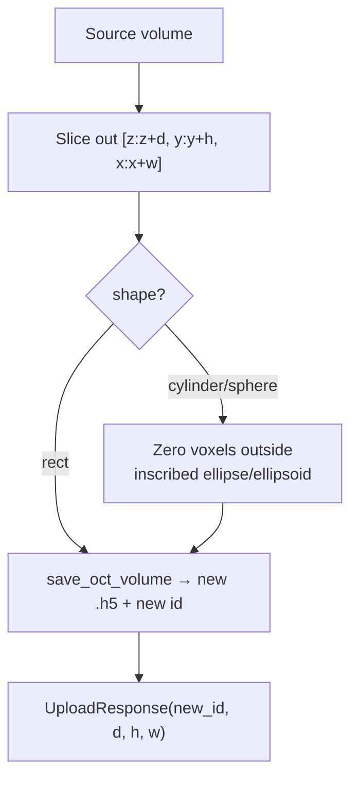
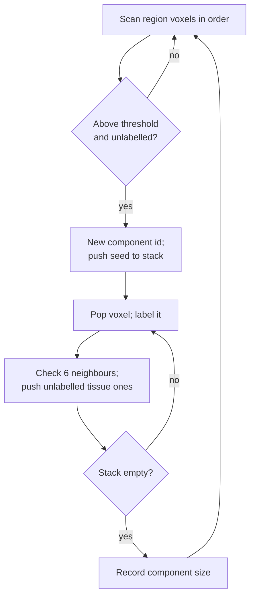

# Cropping & Object Analysis

## Overview

Often only part of a volume is interesting. Lumina lets you **crop** out a
sub-region — optionally masked to a cylinder or sphere — and treat it as a brand
new, fully independent volume. It can also **count distinct 3-D structures**
inside a region (connected-component analysis), reporting how many separate
objects there are and the physical volume of each.

This document covers:

- The crop endpoint and its shape-masking math (`crop.py`).
- The crop UI and the live signal-content readout (`CropSection.tsx`).
- The connected-component object counter (`cropObjectAnalysis.ts`) and its
  golden-angle coloring.

## Cropping a sub-volume

Endpoint: `POST /volumes/{id}/crop` (`backend/src/routers/crop.py`). The crop is
**non-destructive**: the source file is only read; the extracted sub-volume is
written to a fresh `.h5` with a new id. The frontend then loads that id like any
other volume, so the crop supports filtering, measurement, and even re-cropping —
full parity with a loaded file.

### Request

`CropRequest` (`crop.py:19`) is an axis-aligned box in source-volume voxel
coordinates plus a shape:

| Field | Meaning |
|-------|---------|
| `x, y, z` | origin (column, row, slice), each ≥ 0 |
| `width, height, depth` | box size, each ≥ 1 |
| `shape` | `"rect"` (default), `"cylinder"`, or `"sphere"` |

If the box exceeds the volume bounds, the endpoint returns `422` with a detailed
message. If the source volume id doesn't exist, `404`.

### Shape masking — `_apply_shape_mask` (`crop.py:39`)

For `rect` the box is kept as-is. For `cylinder` and `sphere`, voxels outside an
inscribed ellipse/ellipsoid are zeroed, so the stored crop already has the shape
baked in (downstream filtering/measurement then operate only on the shape's
interior).

The half-extents (radii) of the box are `rx = w/2`, `ry = h/2`, `rz = d/2`. For
each voxel at local `(zz, yy, xx)`, normalized squared distances from the box
centre are:

```text
ex = ((xx − (w−1)/2) / rx)²
ey = ((yy − (h−1)/2) / ry)²
ez = ((zz − (d−1)/2) / rz)²
```

- **Cylinder** (ellipse in the x/y footprint, extruded through all z):

$$\text{outside} \iff e_x + e_y > 1$$

- **Sphere** (ellipsoid filling the box):

$$\text{outside} \iff e_x + e_y + e_z > 1$$

Any voxel where the relevant sum exceeds 1 lies outside the inscribed shape and is
set to 0. This is the standard equation of an ellipse/ellipsoid: a point is inside
when the sum of its squared normalized coordinates is ≤ 1.

**Worked example (cylinder).** A 100×100 footprint has `rx = ry = 50` and centre
at `(49.5, 49.5)`. A voxel at the corner `(xx, yy) = (0, 0)`:
`ex = ((0 − 49.5)/50)² = (−0.99)² = 0.980`, `ey = 0.980`, sum `= 1.96 > 1` →
**outside**, zeroed. A voxel at the centre `(50, 50)`: `ex ≈ ey ≈ 0`, sum ≈ 0 ≤ 1 →
**kept**. So the square crop becomes a disc.



### The crop UI (`CropSection.tsx`, `useOpenCrop.ts`)

- **Shape buttons** select rect / circle (cylinder) / sphere.
- **Range sliders** for X, Y, Z define the box, clamped to the volume. The box is
  drawn live as an orange wireframe in the 3-D view and as a draggable shape on
  the 2-D slice panels (a rectangle, or an inscribed ellipse for non-rect shapes,
  drawn in `SlicePanel.tsx`).
- **Signal content** — a quick, strided client-side sample (budgeted to ~100k
  voxels) reports the percentage of voxels above the render visibility threshold,
  the voxel count, and the signal volume in mm³. Because it uses the same
  threshold that gates the 3-D cloud, "signal" means "currently visible".
- **Open Crop** (`useOpenCrop.ts`) resolves the volume id, calls `POST /crop`,
  fetches the new volume's normalized data, and opens it as a new tab titled
  `Crop N: …` recording the source and coordinates.

## Object analysis — counting 3-D structures

File: `frontend/src/features/controls/cropObjectAnalysis.ts`, function
`analyzeRegionObjects` (line 78). This answers: *"inside this region, how many
separate bright structures are there, and how big is each?"* It runs entirely in
the browser on the already-loaded normalized volume, using the same threshold as
the signal readout so the two stay consistent.

### Connected-component flood fill

Two tissue voxels belong to the same object if you can walk between them through
neighbouring tissue voxels. Lumina uses **6-connectivity** (a voxel's neighbours
are the six sharing a face: ±x, ±y, ±z — not diagonals). The algorithm is a
classic flood fill:



Performance choices worth noting:

- **Budget guard:** if the region exceeds `MAX_ANALYSIS_VOXELS = 12,000,000`,
  analysis is refused (returns `tooLarge: true`) to keep the UI responsive.
- The `labels` array (a `Uint32Array`) doubles as the "visited" marker — a voxel
  is labelled the moment it's discovered, so each is visited exactly once.
- The DFS stack is a **growable `Int32Array`** reused across components, avoiding
  the overhead of a plain JS array.
- The seed scan walks in `(lz, ly, lx)` order so the global flat index just
  increments by 1 per step — no division/modulo over up to 12 M voxels.
- **Speckle filter:** components smaller than `MIN_OBJECT_VOXELS = 4` are dropped
  as noise.

Surviving components are sorted **largest first**, and their provisional ids are
remapped to a 1-based **rank** (1 = largest) so the labels line up with the
returned `objects` list.

### Physical volume per object

```text
voxMm3 = (dz · dy · dx) / 1000³
object.volumeMm3 = object.voxels · voxMm3
```

- **`dz, dy, dx`** — voxel spacing in µm.
- **`/ 1000³`** converts µm³ → mm³ (`UM_PER_MM³ = 1,000,000,000`).

**Worked example.** An object of 500,000 voxels at the default `(dz,dy,dx) =
(5.19,20,20)` µm spacing: `voxMm3 = (5.19·20·20)/1e9 = 2076/1e9 = 2.076e−6 mm³`;
`volumeMm3 = 500,000 · 2.076e−6 = 1.038 mm³`.

### Coloring objects — golden-angle hues

So adjacent ranks look distinct, each object gets a color from the **golden-angle
sequence** (`objectColorRgb`, `cropObjectAnalysis.ts:65`):

```text
hue = (((rank − 1) · 137.508°) mod 360) / 360
rgb = hsvToRgb(hue, saturation = 0.7, value = 1.0)
```

- **`137.508°`** is the golden angle. Stepping by it around the 360° color wheel
  never repeats quickly and keeps consecutive ranks far apart in hue — the same
  trick sunflowers use to space seeds (Fibonacci phyllotaxis).
- `hsvToRgb` (`:39`) converts the HSV color to RGB (all channels 0–1).

**Worked example.** Rank 1 → hue `0°` (red). Rank 2 → `137.508°` (green). Rank 3 →
`275.016°` (violet). Rank 4 → `412.524 mod 360 = 52.524°` (orange-yellow). No two
neighbours collide.

The result feeds both the 3-D object-overlay shaders (per-voxel `aColor`) and the
2-D slice tint (`objColorLut` in `SlicePanel.tsx`), so counted objects appear
colored in both viewers when "show object colors" is on. Only voxels at/above the
visibility threshold are tinted, matching the cloud.

### Output (`CropObjectResult`)

| Field | Meaning |
|-------|---------|
| `count` | number of surviving objects |
| `objects[]` | `{ voxels, volumeMm3 }`, largest first |
| `labels` | per-region-voxel rank (0 = background), or `null` if too large |
| `tooLarge` | true if the region exceeded the budget |
| `regionVoxels` | total voxels in the region |

## Related documents

- The shape-mask drag and orient transforms are shared with the slice viewer:
  [2-D Slice Viewer & Geometric Measurements](05-slice-viewer-measurements.md).
- Object colors and overlays are drawn by the GPU shaders described in
  [Normalization, Point-Cloud Rendering & Shaders](03-normalization-rendering.md).
