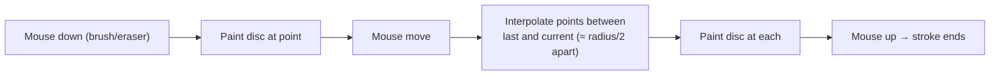

# Annotation

## Overview

Annotation lets a user **paint labels** onto the 2-D slice view with a brush —
for example marking tissue, background, or a structure of interest. The painting
is **non-destructive**: it never touches the underlying HDF5 data. Labels are
stored per-tab in the app state and shown both as a colored tint over the 2-D
slice and as colored voxels in the 3-D view.

This document covers the brush/eraser tools, the per-voxel mask, the fixed color
palette, and the formula behind a circular brush stroke.

Code: `frontend/src/features/annotation/` — `AnnotationToolbar.tsx` (UI),
`annotationMask.ts` (mask logic), `annotationPalette.ts` (colors).

## The label palette

Annotations use a fixed four-label palette (`annotationPalette.ts:17`). Each
label is a small integer stored per voxel (0 means "unannotated"):

| Label | Name | Color |
|-------|------|-------|
| 1 | Tissue | red `#ff5252` |
| 2 | Background | blue `#448aff` |
| 3 | Structure | green `#69f0ae` |
| 4 | Marker | yellow `#ffd740` |

The overlay is drawn semi-transparently with `ANNOTATION_TINT_ALPHA = 0.45`, so
the underlying grayscale slice still shows through. The same palette is used for
the 2-D canvas tint and the 3-D voxel highlight, so a label looks identical in
both views.

## The mask and its sparse index

The annotation mask is a `Uint8Array` with one byte per voxel (the same length as
the full volume — 32 million bytes for a standard volume), holding the label of
each voxel. It lives **per-tab in the Zustand store**, so it travels with the tab
and survives tab switches; an `annotationVersion` counter is bumped on every edit
so subscribers know to redraw.

Scanning all 32 M voxels on every brush stroke or every 3-D refresh would be slow.
So `annotationMask.ts` also keeps a **sparse index** — a `Map` from *global voxel
index → label* — holding only the painted voxels (`indexByFile`, keyed by
fileKey). It is rebuilt lazily from the mask when missing (e.g. after a tab's
buffers were evicted and restored). This lets the 3-D overlay be rebuilt by
iterating only painted voxels.

Helper functions:

- **`paintStroke(params)`** — paint or erase along a stroke (below).
- **`clearAnnotation(fileKey, mask)`** — zero the whole mask and drop the index.
- **`annotatedCount(fileKey, mask)`** — number of painted voxels (shown in the UI).
- **`annotationArrays(fileKey, mask)`** — parallel `{ indices, labels }` arrays of
  every painted voxel, consumed by the 3-D overlay.
- **`disposeAnnotationIndex(fileKey)`** — drop a closed tab's cached index.

## Painting a circular brush stroke

`paintStroke` (`annotationMask.ts:58`) paints a filled disc of a given `radius`
(in voxels) at each point of a stroke, on the current slice of the current axis.
For each stroke point `(ox, oy)` (in pre-orientation "orig" coordinates), it
scans the bounding square `[ox±radius, oy±radius]` and fills only the voxels
inside the circle:

$$(xx - ox)^2 + (yy - oy)^2 \le \text{radius}^2$$

- **`(xx, yy)`** — a candidate voxel in the bounding square.
- **`(ox, oy)`** — the brush centre.
- **`radius²`** — precomputed once per stroke (`r2 = radius·radius`) to avoid a
  square root per voxel.

Voxels passing the test are mapped to a 3-D voxel `(s, vh, vw)` using the same
per-axis convention as the slice viewer (see
[doc 5](05-slice-viewer-measurements.md)), converted to a global flat index, and
written: `label` if painting, `0` if erasing (the eraser is just a paint with
label 0). Both the mask and the sparse index are updated together.

**Worked example.** Brush at `(ox, oy) = (10, 10)` with `radius = 3`
(`r2 = 9`). The voxel `(12, 11)` has `(12−10)² + (11−10)² = 4 + 1 = 5 ≤ 9` → painted.
The corner voxel `(13, 13)` has `(3)² + (3)² = 18 > 9` → skipped. The result is a
round dab, not a square.

## Gap-free strokes

When the mouse moves quickly, consecutive events can be far apart. `SlicePanel`'s
`paintAtEvent` (`SlicePanel.tsx:754`) interpolates between the last painted point
and the current one, inserting intermediate points spaced about `radius/2` apart,
so a fast drag produces a continuous line instead of disconnected dabs. It then
calls `onPaint(points, label)`, which routes to `paintStroke`.

## The toolbar (`AnnotationToolbar.tsx`)

A foldable floating toolbar over the slice view provides:

- **Brush / Eraser** toggle (mutually exclusive with the crop tools — only one
  tool is active at a time).
- A **color-label selector** with the four palette swatches.
- A **brush-radius slider** (in voxels; default radius 6, from the store's
  `brushRadius`).
- A **Clear all** button.
- A live count of painted voxels.

The active tool, brush radius, and active color label are global state in the
Zustand store (`activeTool`, `brushRadius`, `activeColorLabel`); the mask itself
is per-file.

## Inputs, outputs, edge cases

| Action | Effect | Notes |
|--------|--------|-------|
| Brush | writes `activeColorLabel` into disc voxels | interpolated for gap-free drags |
| Eraser | writes `0` into disc voxels | same disc math, label 0 |
| Clear all | zeroes the mask, drops the index | per-tab |
| Tab switch | mask persists in store | index rebuilt lazily if evicted |
| Tab close | `disposeAnnotationIndex` drops cached index | mask discarded with the tab |

Annotation is the one feature here that is **entirely client-side** — it never
calls the backend and never modifies the source data.

## Related documents

- The voxel-coordinate conventions and the orient transforms used to map a brush
  point to a voxel: [2-D Slice Viewer & Geometric Measurements](05-slice-viewer-measurements.md).
- How the 3-D overlay draws the labelled voxels:
  [Normalization, Point-Cloud Rendering & Shaders](03-normalization-rendering.md).
