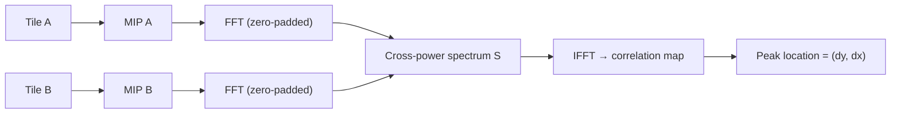
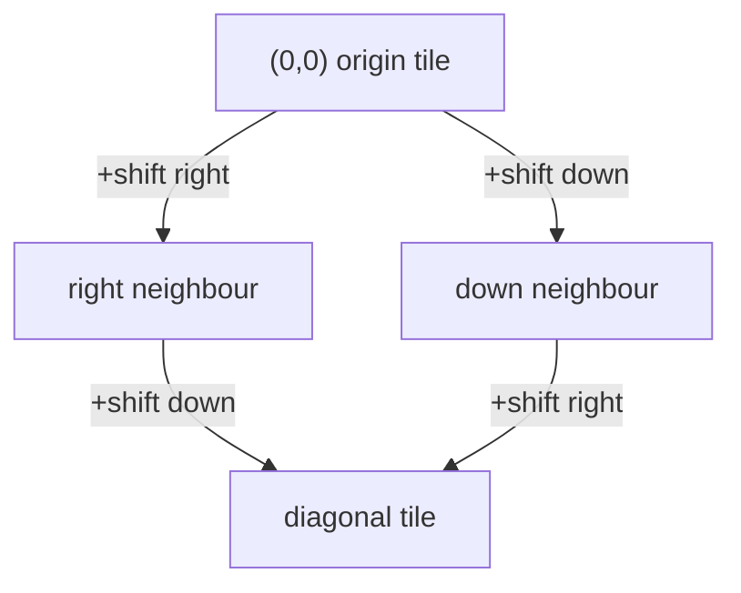

# Multi-Volume Stitching & Registration

## Overview

A single OCT scan covers a limited field of view. To image something larger, you
take several overlapping scans on a grid and **stitch** them into one big volume.
Stitching has three sub-problems:

1. **Registration** — figure out how much each tile is shifted relative to its
   neighbours.
2. **Global alignment** — turn those pairwise shifts into one absolute position
   per tile.
3. **Merging** — blend the tiles into a single volume.

Lumina also offers several **single-volume stitcher algorithms** (used in
comparison jobs) and computes **quality metrics** to judge how well tiles agree.

This document covers the registration math (`multi_volume.py`), the single-volume
stitchers (`stitchers.py`), and the quality metrics (`metrics.py`). The
orchestration (sessions, polling) is in [doc 9](09-jobs-sessions-lifecycle.md).

Terms: a *tile* is one input volume; a *grid position* `(row, col)` says where a
tile sits in the mosaic; a *shift* `(dy, dx)` is a translation in pixels.

## Step 1 — Registration: finding the shift between two tiles

### Max-intensity projection (`compute_mip`, `multi_volume.py:9`)

Registration works on 2-D images, so each 3-D tile is first flattened to a 2-D
**maximum-intensity projection (MIP)** — for each `(y, x)` location, take the
brightest voxel along the depth axis:

```text
MIP(y, x) = max over all slices s of  volume[s, y, x]
```

This collapses the stack into a single "brightest-features" image while keeping
the lateral structure that registration needs.

### Phase correlation (`_phase_corr_padded`, `multi_volume.py:21`)

To find how two images are shifted, Lumina uses **phase correlation**, which works
in the frequency domain (using the Fast Fourier Transform, FFT). The idea: a shift
in space becomes a predictable phase ramp in frequency, and correlating the two
images produces a single sharp peak whose location *is* the shift.

The **cross-power spectrum** is:

$$S = \frac{F_A \cdot \overline{F_B}}{\left|F_A \cdot \overline{F_B}\right| + \varepsilon}$$

- **`F_A`, `F_B`** — the FFTs of the two images.
- **`\overline{F_B}`** — the complex conjugate of `F_B`.
- The numerator correlates them; dividing by the magnitude keeps only the *phase*
  information (hence "phase correlation"), which makes the peak sharp and
  robust to brightness differences. `ε = 1e−10` avoids division by zero.

The shift is the location of the peak in `IFFT(S)` (the inverse FFT):

```text
peak = argmax(real(IFFT(S)))
(dy, dx) = peak position, wrapped into [−N/2, N/2)
```

**Zero-padding (the important detail).** The images are padded to size
`≥ 2N − 1` before the FFT (`H2 = next_fast_len(2H − 1)`, `multi_volume.py:36`).
Without padding, the FFT treats the image as wrapping around (circular
correlation), which **aliases** large shifts: a shift of more than half the image
gets reported with the wrong sign. Padding makes the correlation *linear*, so
every shift up to nearly the full image size maps to a unique, correct peak. After
finding the peak, shifts past the midpoint are wrapped to negative
(`if dy > H2//2: dy −= H2`).



`register_pair(vol_a, vol_b, method)` (`multi_volume.py:53`) ties it together:
MIP both volumes, then phase-correlate. Both `"phase_correlation"` and
`"cross_correlation"` route through the same padded routine.

## Step 2 — Global offsets via BFS (`compute_global_offsets`, `multi_volume.py:85`)

Pairwise shifts are *relative*. To place every tile in one coordinate system,
Lumina runs a **Breadth-First Search (BFS)** over the grid starting from the
top-left tile (the origin, fixed at offset `(0, 0)`), accumulating shifts along
the way:

```text
offset(origin) = (0, 0)
for each known pairwise shift (a → b) = (dy, dx):
    if a is placed and b is not:  offset(b) = offset(a) + (dy, dx)
    if b is placed and a is not:  offset(a) = offset(b) − (dy, dx)
```

BFS spreads outward neighbour-by-neighbour until all tiles have an absolute
offset. Tiles never reached (e.g. a registration that failed to link them) default
to `(0, 0)` with a warning. Accumulating along a connected path keeps the result
consistent even when one individual pair is slightly noisy.



**Worked example.** Three tiles in a row. Origin = `(0,0)`. Pair `origin→middle`
shift = `(2, 100)`, so `middle = (0+2, 0+100) = (2, 100)`. Pair `middle→right`
shift = `(−1, 98)`, so `right = (2−1, 100+98) = (1, 198)`. All three now share one
coordinate frame.

## Step 3 — Merging (`merge_volumes`, `multi_volume.py:127`)

The tiles are blended into one output array using **max-intensity blending**:

$$\text{merged}[s, y, x] = \max_i\; V_i[s,\; y - \Delta y_i,\; x - \Delta x_i]$$

- **`V_i`** — the i-th tile.
- **`(Δy_i, Δx_i)`** — that tile's absolute offset.
- Where tiles overlap, the **brighter** voxel wins. For OCT this is the right
  choice because high intensity means signal — max-blending preserves the bright
  features from every tile rather than averaging them into mush.

Implementation details: offsets are rounded to integers and normalized so the
minimum offset is `(0, 0)` (no negative indices); the output canvas is sized
`total_h = max(dy) + h`, `total_w = max(dx) + w` to fit every tile; each tile is
placed with `np.maximum(region, vol)`.

**Worked example.** Two `250×250` tiles, the second offset by `(0, 200)`
horizontally. The canvas is `250` tall and `200 + 250 = 450` wide. Columns 0–199
come from tile 1 only, columns 200–249 are the overlap (per-voxel max of both
tiles), columns 250–449 come from tile 2 only.

### Overlap extraction for metrics (`overlap_crop`, `multi_volume.py:166`)

To measure how well two tiles agree, the overlapping sub-region of each is
extracted given their relative shift (clamping to valid bounds). It returns
`(crop_a, crop_b)` of equal shape, or `None` if the tiles don't overlap. These
crops feed the RMSE metric below.

## Quality metrics (`metrics.py`)

After stitching, Lumina reports how similar two volumes (or overlap regions) are.
All operate on flattened arrays. Lower error / higher similarity = better
alignment.

### NCC — Normalized Cross-Correlation (`compute_ncc`, `metrics.py:7`)

$$\text{NCC} = \frac{(a - \bar a)\cdot(b - \bar b)}{\lVert a - \bar a\rVert\,\lVert b - \bar b\rVert}$$

- Subtract each array's mean (`\bar a`, `\bar b`) so brightness offset doesn't
  matter, take the dot product, divide by the product of the vector lengths
  (norms). Result is in `[−1, 1]`; `1` = perfectly correlated. Returns `0` if
  either array is constant (guarded by `ε = 1e−10`).

### MI — Normalized Mutual Information (`compute_mi`, `metrics.py:27`)

Measures how much knowing one image tells you about the other (from information
theory), via `skimage.metrics.normalized_mutual_information`. `≥ 1.0`; higher =
more shared information. Unlike NCC it captures non-linear relationships, useful
across different contrasts.

### MSE / RMSE — (Root) Mean Squared Error (`metrics.py:40`, `:72`)

$$\text{MSE} = \frac{1}{N}\sum (a_i - b_i)^2 \qquad \text{RMSE} = \sqrt{\text{MSE}}$$

- Average of the squared per-voxel differences; RMSE takes the square root so the
  error is back in intensity units. `≥ 0`; lower = more similar. RMSE is what the
  stitching session reports, averaged over all overlapping pairs.

**Worked example.** Two tiny overlaps `a = [10, 20, 30]`, `b = [12, 19, 33]`.
Differences `[−2, 1, −3]`; squared `[4, 1, 9]`; MSE `= 14/3 ≈ 4.667`;
RMSE `= √4.667 ≈ 2.16`.

### Dice — Dice Similarity Coefficient (`compute_dice`, `metrics.py:53`)

For binary masks (segmentations):

$$\text{Dice} = \frac{2\,|A \cap B|}{|A| + |B|}$$

- Twice the overlap count divided by the sum of the two mask sizes. `[0, 1]`;
  `1` = identical masks. Returns `1.0` if both masks are empty.

**Worked example.** Mask A marks 100 voxels, mask B marks 120, and they share 90.
Dice `= (2·90)/(100+120) = 180/220 ≈ 0.818`.

### `compute_all` (`metrics.py:85`)

Returns `{ncc, mi, mse, rmse}` for two volumes, adding `dice` when both
segmentation masks are supplied.

## Single-volume stitcher algorithms (`stitchers.py`)

These are alternative alignment algorithms registered in `STITCHER_REGISTRY`
(`stitchers.py:138`) and used by the comparison **job** pipeline
([doc 9](09-jobs-sessions-lifecycle.md)) to align slices *within* one volume.

| Stitcher | Approach | Key params |
|----------|----------|------------|
| `phase_correlation` (`:16`) | Detect shift between the middle and first slice, apply that uniform shift to the whole volume. | `upsample_factor` (10) |
| `simpleitk_affine` (`:37`) | SimpleITK affine registration with **Mattes Mutual Information** (50 histogram bins) and gradient-descent optimization. | `learning_rate` (1.0), `iterations` (100) |
| `elastix_bspline` (`:69`) | Non-rigid **B-spline** registration via the optional `itk-elastix` package. Raises a clear error if not installed. | `iterations` (256) |
| `bigstitcher` (`:103`) | Pairwise phase-correlation between consecutive slices, cumulative-sum the shifts, centre on the middle slice. | — |

### BigStitcher cumulative offsets (`stitchers.py:103`)

```text
shifts[i] = phase_corr(slice[i], slice[i+1])     for i = 0 … n−2
cum_h = cumulative sum of the dy shifts (prefixed with 0)
cum_w = cumulative sum of the dx shifts (prefixed with 0)
cum_h −= cum_h[n//2]    # centre so the middle slice has zero offset
cum_w −= cum_w[n//2]
slice[i] ← shift(slice[i], cum_h[i], cum_w[i])
```

Each slice's correction is the running total of all shifts up to it, re-centred on
the middle slice so the volume doesn't drift off-canvas.

## The stitcher UI

`frontend/src/features/stitcher/`:

- **`StitcherPanel.tsx`** — add tiles (file picker, folder, loaded tabs, or server
  volumes), set each tile's grid `(row, col)` (auto-detected from filenames ending
  `_row_col.h5`), pick a method, and start the stitch.
- **`useStitchSession.ts`** — creates the session, polls until done, downloads the
  merged result, and tracks a `StitchPhase`.
- **`StitchResults.tsx`** — tables of pairwise metrics and per-tile offsets.

## Related documents

- The session orchestration, polling, and memory handling around all of this:
  [Jobs, Sessions & the Async Processing Lifecycle](09-jobs-sessions-lifecycle.md).
- How the merged result is normalized for display:
  [Normalization, Point-Cloud Rendering & Shaders](03-normalization-rendering.md).
