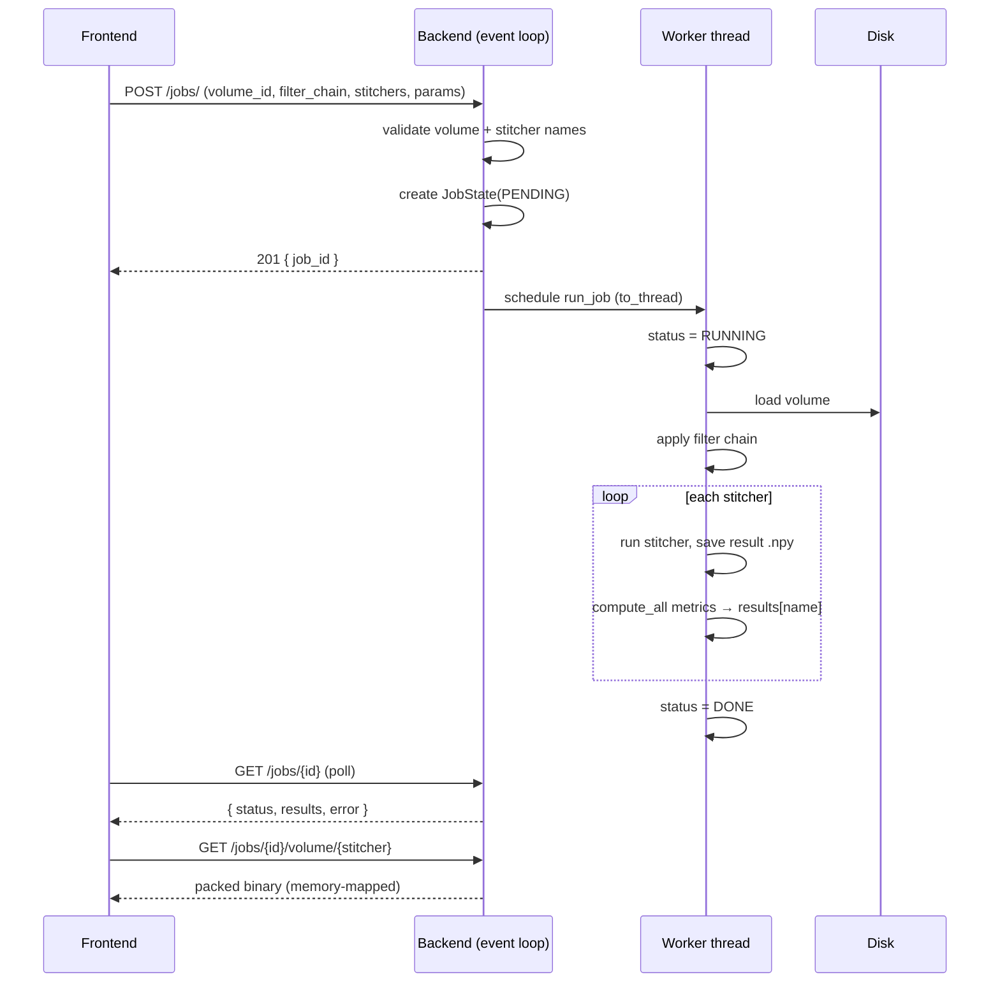
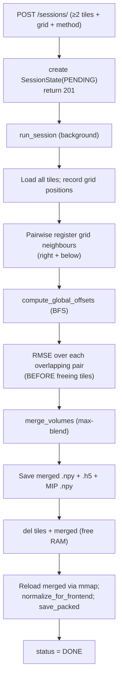

# Jobs, Sessions & the Async Processing Lifecycle

## Overview

Some operations take seconds to minutes — stitching 25 volumes, or running several
registration algorithms for comparison. Lumina runs these in the **background** so
the API stays responsive: the request returns immediately with an id, the work
proceeds on a worker thread, and the frontend **polls** for completion.

There are two background pipelines:

- **Jobs** — single-volume: apply a filter chain, then run one or more stitcher
  algorithms and compute comparison metrics. (`runner.py`)
- **Sessions** — multi-volume: register and merge a grid of tiles into one volume.
  (`session_runner.py`)

This document explains both lifecycles, the async execution model, and the
memory-management strategy that keeps peak RAM bounded.

## Why background execution

FastAPI serves requests on an async event loop. If a request did its heavy
NumPy/SciPy work inline, it would block the loop and freeze the whole API. Lumina
avoids this two ways:

- The create endpoint returns instantly (HTTP 201) after scheduling the work via
  Starlette's `background_tasks`.
- The actual CPU-bound work is pushed onto a worker thread with
  `asyncio.to_thread(...)`, so the event loop stays free to answer poll requests.

State is held in simple in-memory stores (Python dicts). No locking is needed: the
event loop is single-threaded, and Python's GIL plus asyncio make the
worker-thread state updates visible to pollers.

## Single-volume jobs (`runner.py`)

### State

`JobState` (`runner.py:18`) holds `status` (a `JobStatus` enum), `results` (a map
of stitcher name → metrics dict), and an optional `error` string. `JobStore`
(`runner.py:25`) creates and retrieves jobs; `job_store` is the singleton.

`JobStatus` (`schemas/enums.py`) is a string enum: `PENDING`, `RUNNING`, `DONE`,
`ERROR`.

### Lifecycle

`_execute_pipeline` (`runner.py`) loads the volume, applies the filter chain
(`copy_input=False` on the first filter to skip a defensive copy), then for each
requested stitcher runs it, saves the result as `{job_id}_{stitcher}.npy`, and
computes metrics comparing the preprocessed input to the stitcher output. If one
stitcher throws, its error is recorded in `results` and the others still run. The
async wrapper `run_job` sets `RUNNING`, delegates to the worker thread, and on any
exception sets `ERROR` with a message.

**Validation at create time:** the volume must exist (else 404) and every stitcher
name must be known (else 400 with the list of unknown names).

**Downloading results** (`results.py`): `GET /jobs/{id}/volume/{stitcher}` returns
the result as a packed binary. It loads the `.npy` with `mmap_mode="r"`
(memory-mapping — the file stays on disk and the OS pages in only what's read), so
normalization can stream slice-by-slice without holding the whole volume in RAM.
It returns 404 if the job/result is missing and 409 if the job isn't `DONE` yet.

> Note: the preprocessing UI uses the lean `/volumes/{id}/filter` endpoint
> ([doc 4](04-preprocessing-filters.md)), not this job pipeline. Jobs remain for
> stitcher-comparison runs.

## Multi-volume sessions (`session_runner.py`)

### State

`SessionState` (`session_runner.py:24`) holds `status`, `offsets` (tile id →
`[dy, dx]`), `metrics` (e.g. `rmse`), `merged_volume_id`, and `error`.
`SessionStore`/`session_store` mirror the job store.

### Lifecycle (`run_session`, `session_runner.py:53`)

The registration, BFS, merge, and metric math are all explained in
[Multi-Volume Stitching & Registration](08-stitching-registration.md). The session
runner is the *orchestrator* that calls them in order and persists the outputs:

- **`{session}_merged.npy`** — for fast memory-mapped re-reads.
- **`{session}_merged.h5`** — so filters can be applied to the merged volume.
- **`{session}_mip.npy`** — the max-intensity projection for quick visualization.
- **`{session}_frontend.bin` / `.json`** — the pre-computed packed binary, so the
  download endpoint serves a file instead of recomputing.

### Polling and download

- `GET /sessions/{id}` returns `{status, offsets, metrics, merged_volume_id,
  error}`.
- `GET /sessions/{id}/merged` returns the merged packed binary (pre-computed when
  available, else computed on demand).
- `GET /sessions/{id}/mip` returns the 2-D MIP.
- `POST /sessions/{id}/filter` applies a filter chain to the merged `.h5` and
  returns a fresh packed binary.

Validation: a session requires at least 2 tiles (else 400); unknown session → 404;
"merged not available yet" → 404 while still running.

## Memory management — the critical ordering

A 25-tile session is the worst case: ~800 MB of tiles + ~1 GB merged array +
normalization scratch could exceed 2.5 GB if all coexist. The session runner is
carefully ordered to prevent overlap (`session_runner.py:108-150`):

1. **Compute RMSE metrics *before* merging**, while the individual tiles are still
   loaded — so the tiles can be freed immediately after.
2. **Build the merged array**, save it to disk (`.npy`, `.h5`, MIP).
3. **`del` the tiles and the merged array** explicitly, releasing ~1.8 GB *before*
   normalization allocates its buffers.
4. **Reload the merged volume via `np.load(..., mmap_mode="r")`** — memory-mapped,
   so the OS keeps only ~50 MB of pages live at a time instead of the full 1 GB —
   and run `normalize_for_frontend` on that.

This staging keeps peak RAM well under the naïve 2.5 GB.

## Comparison of the two pipelines

| | Job | Session |
|--|-----|---------|
| Scope | one volume | many tiles |
| Create endpoint | `POST /jobs/` (201) | `POST /sessions/` (201) |
| Poll endpoint | `GET /jobs/{id}` | `GET /sessions/{id}` |
| Work | filter chain + stitcher algorithms + metrics | register → BFS → merge → normalize |
| Result download | `GET /jobs/{id}/volume/{stitcher}` | `GET /sessions/{id}/merged` |
| State store | `job_store` | `session_store` |
| Execution | `asyncio.to_thread` worker | async background task |

## Error handling

Both pipelines wrap their work in try/except: on failure the state's `status`
becomes `ERROR` and `error` holds `"{ExceptionType}: message"`, which the poll
endpoint surfaces to the UI. Per-stitcher failures inside a job are isolated so
one bad algorithm doesn't sink the whole job. A global handler in `main.py`
returns a CORS-aware 500 for anything unhandled.

## Related documents

- The algorithms these pipelines orchestrate:
  [Multi-Volume Stitching & Registration](08-stitching-registration.md),
  [Preprocessing Filters](04-preprocessing-filters.md).
- The packed-binary output and `save_packed`/`load_packed`:
  [Normalization, Point-Cloud Rendering & Shaders](03-normalization-rendering.md).
- All endpoints in one place: [API Reference](12-api-reference.md).
