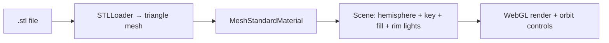
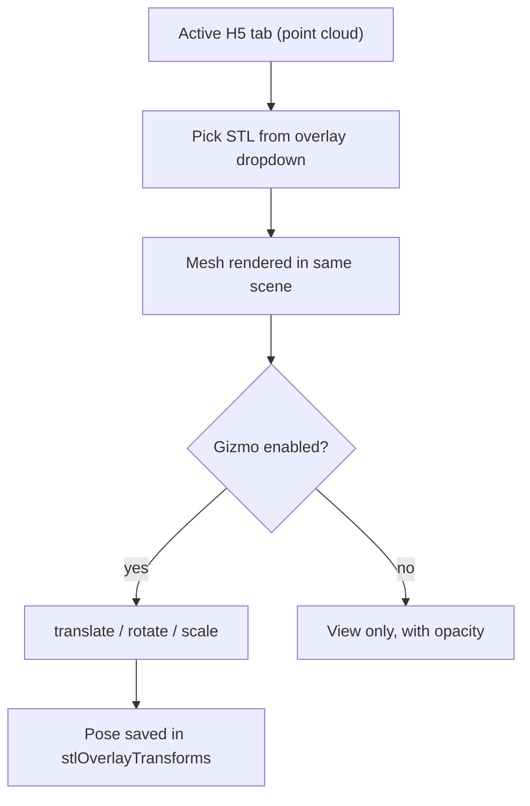

# STL Viewer & 3-D Overlay

## Overview

Besides OCT volumes, Lumina can load **STL files** — a common 3-D format that
describes a surface as a mesh of triangles (used for CAD models, 3-D prints, and
segmented anatomy). STL files open as their own tabs, and an STL can also be
**overlaid** on an OCT volume and interactively positioned with a transform
gizmo, which is useful for comparing a model against the imaged data
(registration).

This document covers the standalone STL viewer and the overlay/registration
workflow. Code: `frontend/src/features/stl/STLViewer.tsx` and the shared
`frontend/src/shared/three/sceneUtils.ts`.

Terms: a *mesh* is a surface built from triangles; a *gizmo* is the on-screen
handle (arrows/rings) you drag to move, rotate, or scale an object.

## The standalone STL viewer (`STLViewer.tsx`)

When an STL tab is active, `STLViewer` renders the mesh in a Three.js (WebGL)
scene. Its main ingredients:

- **Geometry** — Three.js's `STLLoader` parses the binary or ASCII STL into a
  triangle mesh.
- **Material** — a `MeshStandardMaterial` (physically-based) with low metalness
  (~0.1) and medium roughness (~0.55), so the surface reads as a solid object
  rather than a mirror.
- **Lighting** — a four-light setup: a hemisphere light (soft ambient sky/ground),
  a key directional light (the main highlight), a fill light (softens shadows),
  and a rim light (separates the silhouette from the background).
- **Edge highlighting** — silhouette lines are drawn where adjacent faces meet at
  a sharp angle (above ~20°), emphasizing structure.
- **Tone mapping / color** — ACES filmic tone mapping and the sRGB color space
  for natural-looking shading.
- **Interaction** — orbit controls (drag to rotate, scroll to zoom), with optional
  zoom-to-cursor.

## Shared scene utilities (`sceneUtils.ts`)

Both the STL viewer and the point-cloud viewer build their scenes through shared
helpers so setup and teardown are consistent:

- **`createScene(container, options?, canvas?)`** — boilerplate Three.js scene,
  camera, and renderer. It can reuse a persistent canvas (passed via a React
  `useRef`) so that React StrictMode's double-mount reuses the same WebGL context
  instead of allocating a second one (browsers cap active contexts at ~16).
- **`disposeSceneGeometry(scene)`** — frees geometries, materials, and textures
  before the renderer is disposed, preventing GPU memory leaks. Sprite materials
  with canvas textures need explicit disposal before this call.

## STL overlay on an OCT volume

While viewing an OCT volume in the 3-D point-cloud view, the user can pick an STL
from the **STL Overlay** dropdown. The mesh is then rendered *in the same scene*
as the point cloud, sharing the camera and orbit controls, so the two can be
compared directly. A per-overlay **opacity slider** lets the mesh fade so the
points behind it stay visible.

The overlay relationship and its pose are stored in the Zustand state
(`app/store/viewerSlice.ts`):

| State field | Meaning |
|-------------|---------|
| `stlOverlayIndex` | which STL tab is overlaid on the active H5 tab (or none) |
| `stlOpacity` | overlay transparency |
| `stlGizmoActive` | whether the transform gizmo is shown |
| `stlGizmoMode` | `'translate'` \| `'rotate'` \| `'scale'` |
| `stlOverlayTransforms` | per-STL saved pose (position/rotation/scale) |

## Registration with the transform gizmo

To align the mesh to the imaged data, the user enables the gizmo and chooses a
mode:

- **Translate** — drag arrows to move the mesh along X/Y/Z.
- **Rotate** — drag rings to rotate about each axis.
- **Scale** — drag handles to resize.

This uses Three.js `TransformControls`. The resulting pose (position, rotation,
scale) is saved per-STL in `stlOverlayTransforms`, so it persists across view
changes and tab switches — you can register a mesh once and it stays put.

## Tab handling

STL tabs share the single unified tab bar with H5 tabs (see
[Frontend Shell, State & Theming](11-frontend-shell-state.md)), visually
distinguished with a blue tint. They can be dragged to reorder freely alongside
H5 tabs. Closing an STL tab also clears it as an overlay if it was assigned to one.

## Inputs, outputs, edge cases

| Aspect | Detail |
|--------|--------|
| Input | binary or ASCII `.stl` |
| Output | rendered mesh (standalone) or overlay on a point cloud |
| Overlay scope | one STL per active H5 tab at a time |
| Pose persistence | saved per STL, survives view/tab changes |
| Resource cleanup | `disposeSceneGeometry` before renderer disposal |

## Related documents

- The point-cloud scene the overlay shares:
  [Normalization, Point-Cloud Rendering & Shaders](03-normalization-rendering.md).
- Tab and overlay state:
  [Frontend Shell, State & Theming](11-frontend-shell-state.md).
