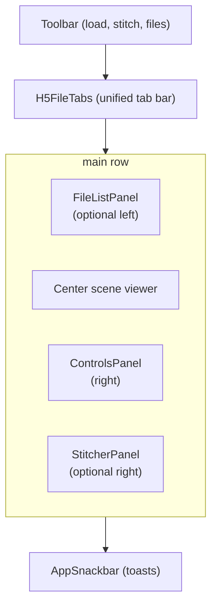

# Frontend Shell, State & Theming

## Overview

This document describes the parts of the frontend that hold everything else
together: the top-level layout, the single Zustand state store that every feature
reads and writes, tab management, the memory-eviction model, and the MUI theme. If
the other frontend docs explain individual features, this one explains the
*container* they live in.

Code: `frontend/src/App.tsx`, `frontend/src/app/store/viewerSlice.ts`,
`frontend/src/shared/theme/`, and the `features/toolbar`, `features/files`,
`features/notifications`, `features/onboarding` folders.

## The application shell (`App.tsx`)

`App.tsx` is the top-level layout. It decides what to render based purely on
application state — there is no URL routing. The layout is roughly:

The **center viewer** dispatches on the active tab:

- `type === 'stl'` → `STLViewer` ([doc 10](10-stl-viewer-overlay.md)).
- `type === 'h5'` and `viewMode === 'pointcloud'` → `H5Viewer` (3-D,
  [doc 3](03-normalization-rendering.md)).
- `type === 'h5'` and `viewMode === 'slice'` → `H5SliceViewer` (2-D,
  [doc 5](05-slice-viewer-measurements.md)).
- no tabs → `EmptyState` (drag-and-drop landing screen).

Heavy viewers are **code-split** (loaded on demand) so the initial bundle stays
small. `main.tsx` mounts the app inside MUI's `ThemeProvider` with the medical
theme.

## The state store (`viewerSlice.ts`)

All app state lives in a single **Zustand** store (Zustand is a lightweight state
manager). Components subscribe to just the slices they need (often via
`useShallow` for efficient re-rendering). The store has two layers:

### Top-level state

| Field | Purpose |
|-------|---------|
| `tabs: TabEntry[]` | unified list of open H5 and STL files |
| `activeTabIndex` | which tab is showing |
| `h5PerFileStates` | per-file state, keyed by file (see below) |
| `hydrationOrder` | LRU order for memory eviction |
| `stlOverlayIndex`, `stlOpacity`, `stlGizmo*`, `stlOverlayTransforms` | STL overlay state ([doc 10](10-stl-viewer-overlay.md)) |
| `stitchPanelOpen`, `controlsPanelOpen`, `fileListPanelOpen` | panel visibility |
| `cropCounter` | numbering for "Crop N" tabs |
| `activeTool`, `brushRadius`, `activeColorLabel` | annotation/crop tool state ([doc 7](07-annotation.md)) |
| `isLoading`, `notification` | global UI status |
| `zoomToCursor`, `axesVisible` | viewer preferences |

### Per-file state (`H5PerFileState`)

Each H5 tab carries its own settings so switching tabs preserves everything:
render controls, camera pose, `viewMode`, current slice indices, per-panel
brightness/contrast, colormap and range, voxel spacing, measurement result, crop
box/shape/mode, the annotation mask + version, the filter pipeline steps and
before/after snapshot, and object-labeling results. Defaults for the render
controls (`viewerSlice.ts`):

| Control | Default | Meaning |
|---------|---------|---------|
| `volumeSpacing` | 250 | scene Y-axis stretch |
| `h5Threshold` | 0.75 | visibility threshold (0–1) |
| `h5Opacity` | 0.25 | point-cloud alpha |
| `h5Brightness` | 5.0 | brightness multiplier |
| `h5Contrast` | 1.0 | tone-map exponent |
| `h5PointSize` | 1.0 | point size |
| `h5SliceRange` | [0, 512] | Z clip |
| `h5WidthRange` | [0, 250] | X clip |
| `h5HeightRange` | [0, 250] | Y clip |

Slider limits for all of these are derived from `VOLUME_DIMS` in
`renderControlLimits.ts`, never hardcoded.

### Key actions

- **Tabs:** `loadH5`, `loadStlFiles`, `selectTab`, `closeTab`, `reorderTab`.
- **Memory:** `ensureHydrated` (restore buffers from IndexedDB), LRU eviction to
  keep ≤ 2 volumes on the heap.
- **Render/filter:** `updateActiveRenderState`, `setNormalizedVolume`,
  `applyBackendFilter`, `saveFilterSnapshot`, `setFilterApplied`,
  `setShowingComparison`.
- **Crop/annotation:** `setCropMode`, `setCropBox`, `setCropShape`,
  `paintAnnotation`, `clearAnnotations`, `setObjectLabeling`,
  `setObjectColorsVisible`.
- **Camera:** `saveH5CameraState`, `requestCameraReset`.

## Tab management (`H5FileTabs.tsx`)

All H5 and STL files share one scrollable tab bar. Tabs can be **dragged to
reorder** regardless of type (the drag indices stay synced with MUI's `value`).
Each tab has a close button; STL tabs get a distinct tint. Closing a tab cleans up
its server-side uploads and its IndexedDB entry.

## Memory eviction (recap)

Because volume buffers are large, at most `MAX_HYDRATED_FILES` (2) volumes keep
their `vIndices`/`vIntensities`/`normalizedVolume` on the JS heap. Inactive tabs
are evicted to IndexedDB (`shared/h5/volumeCache.ts`), carrying only lightweight
`meta` + `hasSlices` until reactivated, when `ensureHydrated` restores them.
Volumes over ~512 MB stay resident-only. This is detailed in
[Volume Ingestion & Storage](02-volume-ingestion-storage.md).

## Supporting features

- **Toolbar (`features/toolbar/`)** — Load STL, Load H5 (File / Folder / Server),
  Stitch toggle, Files (server volume count), and a loading indicator.
  `useFileLoad.ts` owns the file-input refs and load handlers; files load **one at
  a time** (not `Promise.all`) to avoid out-of-memory on folder uploads.
- **File list (`features/files/FileListPanel.tsx`)** — left sidebar listing
  server-side `.h5` files grouped by folder (`shared/utils/groupByFolder.ts`),
  with register-by-path or upload actions.
- **Notifications (`features/notifications/AppSnackbar.tsx`)** — transient toast
  for success/error/info.
- **Onboarding (`features/onboarding/EmptyState.tsx`)** — the drag-and-drop
  landing screen shown when no file is loaded.

## Theming (`shared/theme/`)

MUI is the **only** styling system — there are no CSS files. The theme is split:

| File | Contents |
|------|----------|
| `palette.ts` | all color tokens (primary, accent, scene, crop, annotation, axis, lights, scrims, …) |
| `theme.ts` | the MUI `medicalTheme` via `createTheme` (light mode) |
| `uiTokens.ts` | shared text styles: `eyebrowSx`, `microLabelSx`, `compactButtonSx` |
| `layout.ts` | layout dimensions: panel widths, rail width, `PANEL_PADDING` |

Conventions: complex component styles with pseudo-selectors go in co-located
`.styles.ts` files; simple 1–3 property overrides stay as inline `sx` props.
Magic numbers become `SCREAMING_SNAKE_CASE` module constants, promoted to
`shared/constants.ts` only when used in 3+ files.

## The API client (`shared/api/`)

`client.ts` provides typed fetch helpers for every endpoint —
`uploadVolume`, `registerLocalVolume(sBatch)`, `fetchNormalizedVolume`,
`cropVolume`, `filterVolume`, `filterSessionVolume`, `createSession`,
`pollSession`, `cleanupUploads` — plus `parseNormalizedVolume`, which reads the
packed binary into zero-copy typed-array views over one `ArrayBuffer`. `types.ts`
holds the request/response types (`FilterStep`, `JobStatus`, `SessionRequest`,
`UploadResponse`, `RegistrationMethod`, …). Both are detailed alongside the
[API Reference](12-api-reference.md).

## Related documents

- The individual viewers this shell hosts:
  [doc 3](03-normalization-rendering.md), [doc 5](05-slice-viewer-measurements.md),
  [doc 10](10-stl-viewer-overlay.md).
- The memory model: [Volume Ingestion & Storage](02-volume-ingestion-storage.md).
